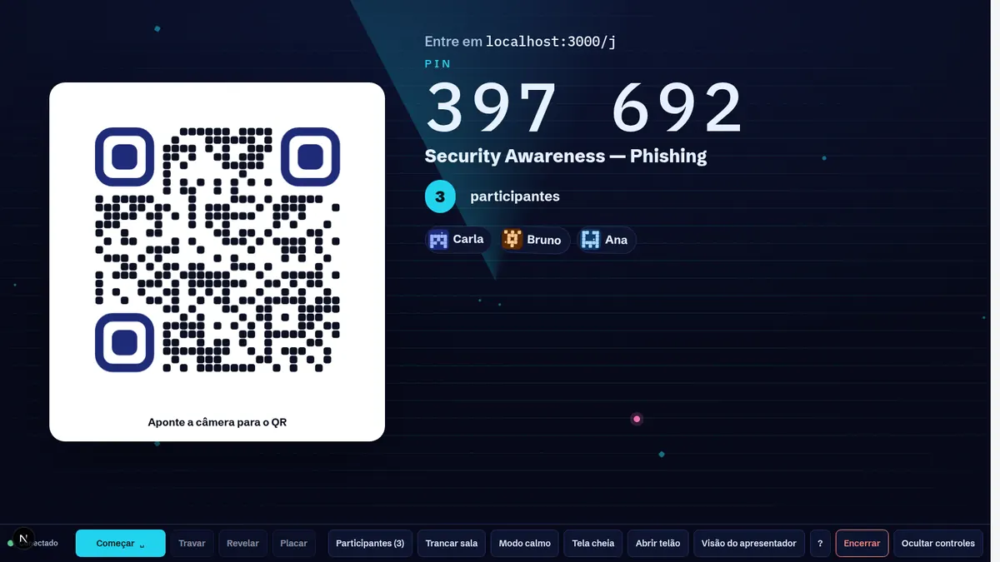
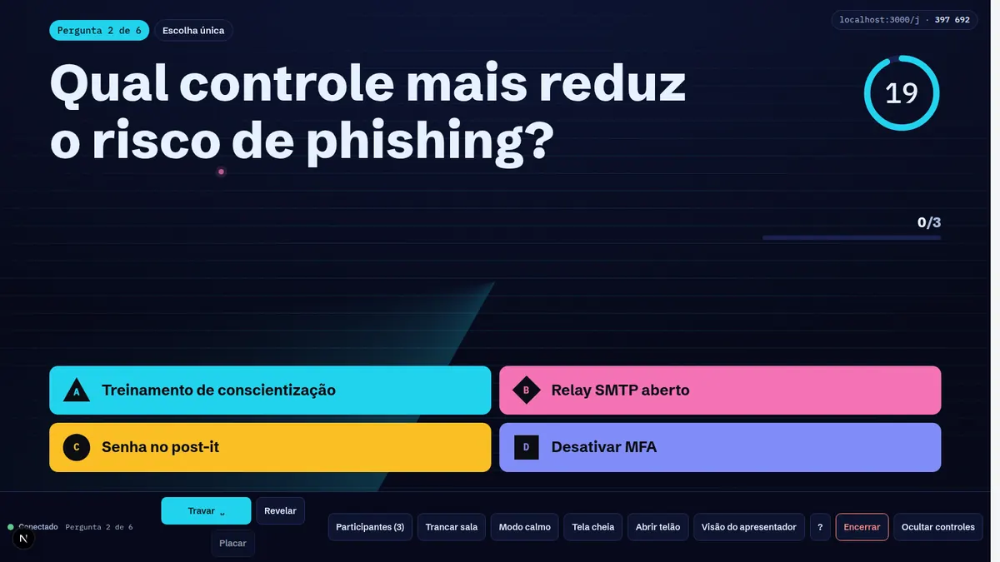
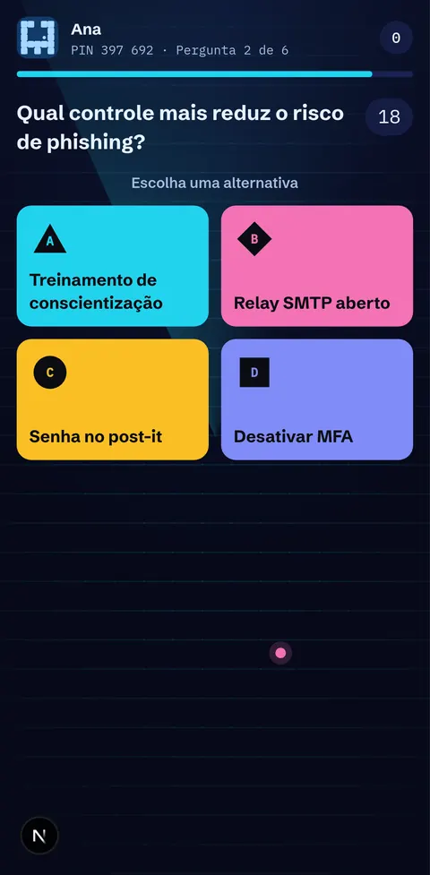
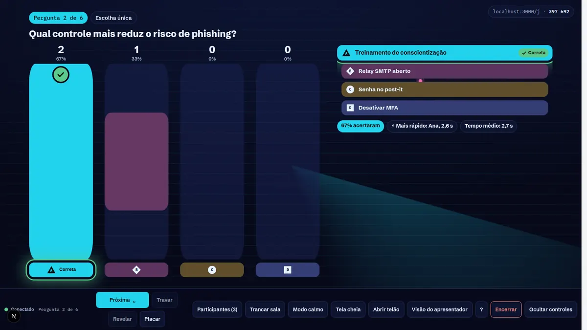
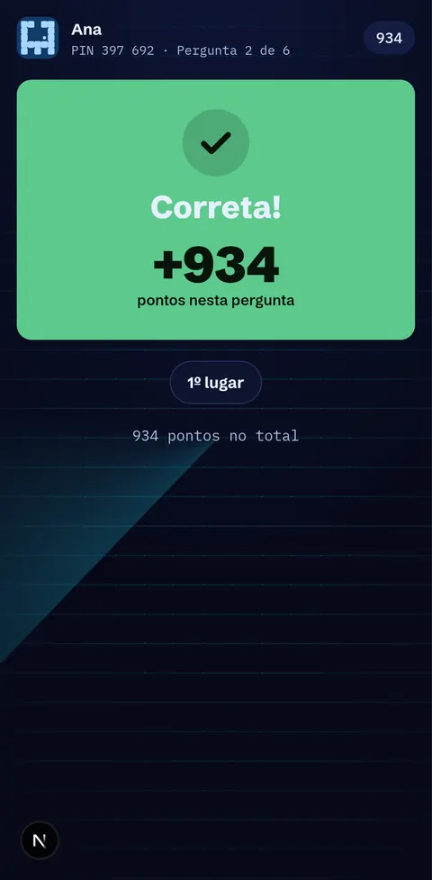
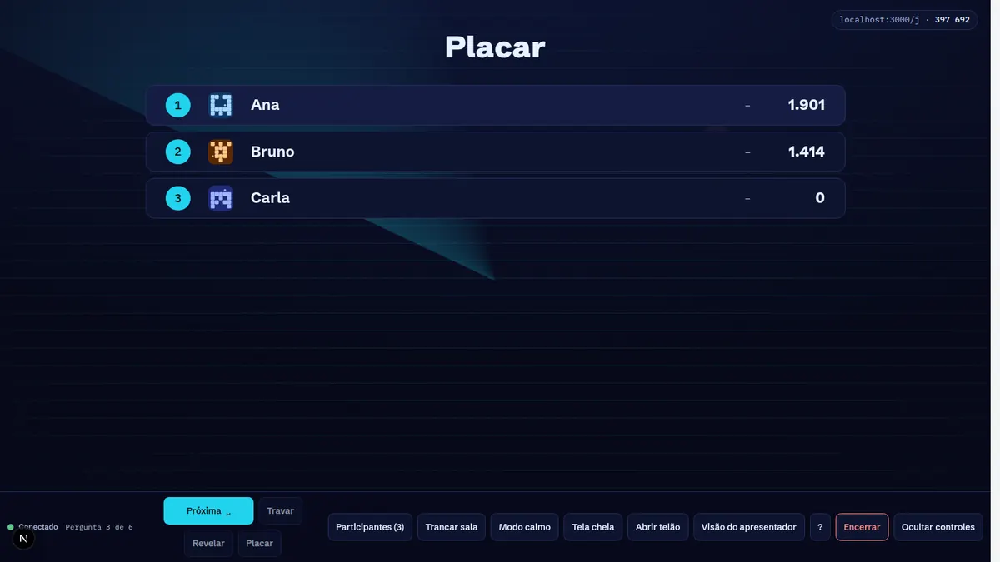
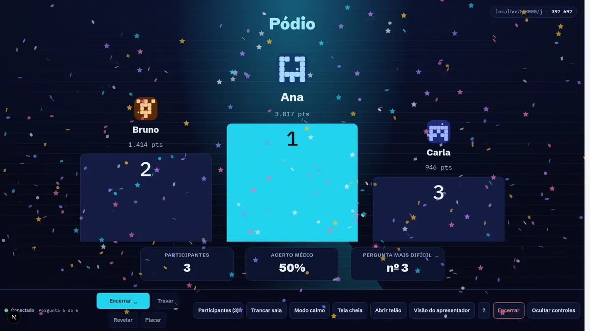

# Sentinel Arena: Incremento 1 (Fundações + núcleo do MVP-0)

Primeira fatia vertical do [plano](./PLANO.md), construída sobre o [contrato](./CONTRATO-INCREMENTO-1.md).
Um instrutor cria um quiz (próprio ou com questões do Banco), publica, abre a sala e apresenta no telão.
A turma entra pelo QR code ou PIN **só com o nome**, responde pelo celular em tempo real, e o owner
recebe o relatório com psicometria e CSV.

## Telas

| Telão (projetor) | Celular (participante) |
|---|---|
|  |  |
|  |  |
|  |  |
|  |  |
|  |  |

Autoria e análise: [biblioteca](./screenshots/01-biblioteca.webp), [editor](./screenshots/02-editor.webp),
[visão do apresentador](./screenshots/16b-visao-apresentador.webp), [relatório](./screenshots/20-relatorio.webp).

## O que foi entregue

### Backend (`backend/`)
| Área | Arquivos | Destaques |
|---|---|---|
| Licença do banco (pré-requisito, DC-21) | `alembic/versions/0018_license_scope.py`, `services/licensing.py`, `services/ingest.py` | `questions.license_scope` classificado **por proveniência** no ingest. Com o banco atual: 812 `platform`, 2.076 `pending_audit`, como previsto na matriz §11.1.1. Salas com convidados só aceitam `own` (mais `platform` com `LIVE_PLATFORM_GUEST_OK`); `personal_use` nunca entra |
| Modelo de dados | `models.py`, `alembic/versions/0019_live_quiz.py` | `live_quiz`, `live_quiz_item`, `live_quiz_version` (snapshot imutável com gabarito), `live_session` (PIN único só entre salas ativas, via índice parcial), `live_session_item`, `live_participant`, `live_answer_event` (append-only; no PostgreSQL um trigger bloqueia `UPDATE`) |
| Autoria | `services/live_quiz.py`, `services/live_items.py`, `schemas_live.py`, `api/live.py` | CRUD com lock otimista (`expected_version` → 409), 7 tipos (única, múltipla com crédito parcial, V/F, digitada, enquete, conteúdo, placar), importação do banco com conversão de tipo, validação de publicação com issues por item, duplicar, arquivar |
| Sessão e convidados | `services/live_session.py`, `services/live_names.py`, `services/live_tokens.py` | PIN de 6 dígitos, QR SVG (`segno`), entrada só com nome e consentimento, token HMAC com `kid` (rotação), código de retorno de uso único, filtro de apelidos pt-BR/en com leetspeak, apelidos gerados para público infantojuvenil, vínculo automático para quem está logado |
| Tempo real | `live/runtime.py`, `live/gateway.py`, `live/bus.py`, `live/protocol.py`, `live/db.py`, `live/main.py` | Protocolo `sq.live.v1`. Máquina de estados com transições **compare-and-set** (idempotentes entre workers). Timer do servidor com fase de leitura e tolerância. Trava automática no prazo ou quando todos responderam. RTT medido pelo servidor. Barramento em memória ou Redis Pub/Sub. Fila de envio limitada. Rate limit por conexão. Validação de Origin (CSWSH). Snapshot autoritativo a cada (re)conexão, e o host recebe snapshot a cada transição |
| Pontuação e relatório | `services/live_scoring.py`, `services/live_results.py` | Fórmula de velocidade da §6.2 com crédito de latência limitado a 300 ms, streak opcional e desempate determinístico. Relatório com KPIs, p, D (27%), distratores superior/inferior, KR-20, flags, acerto por domínio com faixas, CSV protegido contra injeção de fórmula, resultado pessoal do participante |

### Frontend (`web/`)
| Área | Rotas / pastas |
|---|---|
| Autoria | `/quizzes` (biblioteca), `/quizzes/[id]/edit` (editor em 3 painéis com prévia do telão, autosave serializado, seletor do banco com licença, configurações, publicar, apresentar), `/quizzes/[id]/sessions` |
| Apresentação | `/present/[sessionId]`: telão com coreografia completa (lobby → leitura → pergunta → trava → reveal → placar → pódio), barra do host com atalhos, visão do apresentador (`?view=presenter`, com gabarito e notas), janela de telão só leitura via display token |
| Participante | `/j` (PIN), `/j/[code]` (entrada, código de retorno, lobby, painéis de resposta por tipo, feedback com háptica, placar, resultado final, "minhas respostas") |
| Relatório | `/quizzes/[id]/results/[sessionId]` (KPIs, itens com p/D/flags e gráfico de distratores, participantes, domínios, CSV, impressão) |
| Base | `features/quiz-live/lib` (cliente WebSocket com backoff/outbox/watchdog, sincronização de relógio, store com seletores), `components/quiz-kit` (QR animado, anel de contagem, barras, placar FLIP, pódio com confete), `styles/live-themes.css` (5 temas com tokens `--lq-*`, contraste AA e alto contraste ≥7:1), i18n pt-BR/en-US |

### Infraestrutura
- `docker-compose*.yml`: variáveis `APP_LIVE_*` (ligado por padrão no stack de dev; **desligado em produção** até definir `APP_LIVE_TOKEN_KEYS`).
- `docker/nginx/default.conf.template`: `location = /api/live/ws` sem buffering e com timeout de 75 s.
- Dependências novas: `segno` (backend, com hash no lock); `motion`, `canvas-confetti` e `uqr` (web).

## Como verificar

```bash
# Backend: 413 testes (57 do Sentinel Arena, incluindo ingest e migrações); PostgreSQL com TEST_DATABASE_URL
cd backend && python -m pytest -q

# Frontend
cd web && npm run typecheck && npm run lint && npm test && npm run build

# Partida real no navegador (API + web rodando, LIVE_ENABLED=true, LIVE_HOST_POLICY=all)
cd web && LIVE_SMOKE_OUT=/tmp/arena node scripts/live-smoke.mjs
```

Evidências desta entrega (30/09/2026):
- **Backend:** suíte completa verde. As migrações 0018/0019 passaram também em PostgreSQL 16 (upgrade, round-trips, downgrade, índice parcial e trigger append-only).
- **Frontend:** typecheck, lint sem erros, 277 testes e build.
- **Navegador real:** partida ponta a ponta com host, telão, visão do apresentador e 3 celulares, sobre PostgreSQL. Rodou com 1 worker e também com **2 workers + barramento Redis** (configuração do compose de produção). Todas as respostas foram registradas, com ranking e relatório corretos.

Problemas encontrados pela validação e já corrigidos: pódio duplicado ao encerrar; unidades `cqh` zeradas no telão (altura indefinida do container); barra de controles cobrindo o palco; gabarito do apresentador casando pelo id opaco; chave de token de desenvolvimento diferente em cada worker; denominador de acertos contando enquetes.

## Desvios do plano (conscientes)

| Plano | Incremento 1 | Motivo / próximo passo |
|---|---|---|
| Serviço `live` separado + `redis-live` com Lua e stream (DC-02/04/05) | Gateway dentro da `api` (app `app.live.main` já pronto para o serviço separado); estado autoritativo no PostgreSQL com CAS; Redis só para fan-out | Mais simples de operar no MVP-0. Trocar pelo aceite em Lua quando o teste de carga (k6, 1.000 por sala) mostrar gargalo no INSERT síncrono |
| Replay por delta e fallback SSE | Sempre `room.snapshot` na reconexão; só WebSocket | Fallback SSE é Must antes do beta aberto (MVP-1) |
| Trigger bloqueando `DELETE` em `live_answer_event` | Só `UPDATE` é bloqueado | `DELETE` fica para cascata/retenção até existirem as funções `SECURITY DEFINER` e o papel `sentinel_app` (DC-25) |
| Root layout leve `(live)` para `/j` (DC-23) | `/j` usa o root layout atual sem o shell | Entra com o teste de pico do QR (RNF-210) |

## Próximos incrementos

1. **IA de criação** (`/api/ai/*`, jobs, crítico, revisão humana), usando o `review_state` que já existe.
2. **Carga e resiliência:** k6 com 1.000 participantes pelo nginx, fallback SSE, pausa/extensão de tempo, tempo estendido por participante, ensaio com bots.
3. **Mais tipos** (ordenar, numérica, nuvem de palavras), mais temas, som e controle remoto no celular.
4. **Self-paced**, XLSX/PDF, insights de IA, claim de convidado para conta e autoatendimento LGPD (`/me` DELETE).
5. **Auditoria de licença do banco (E0.1)**, para liberar questões `own` em salas com convidados.
