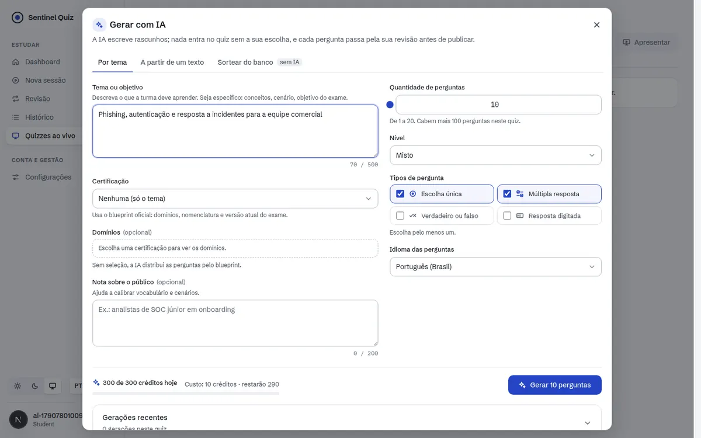
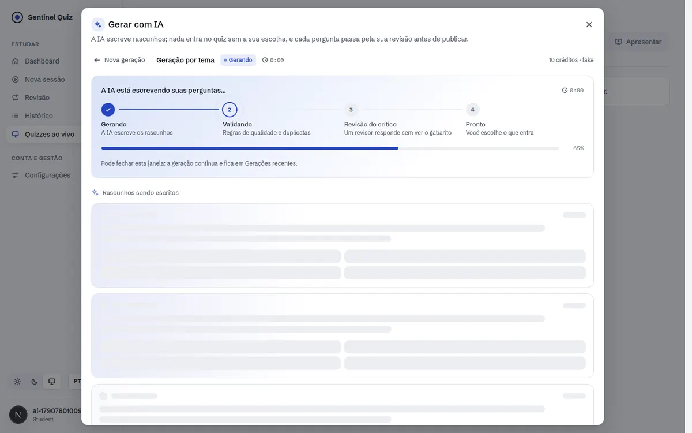
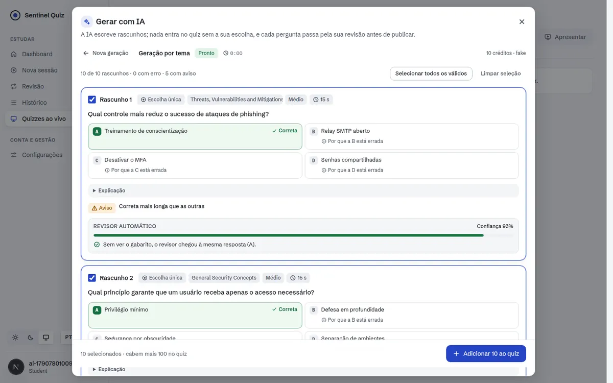
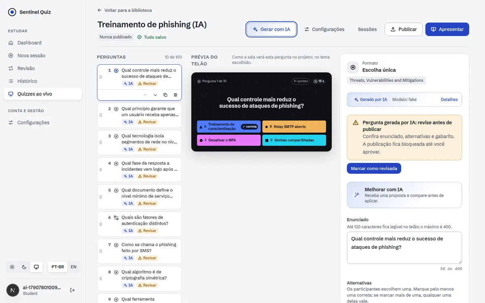
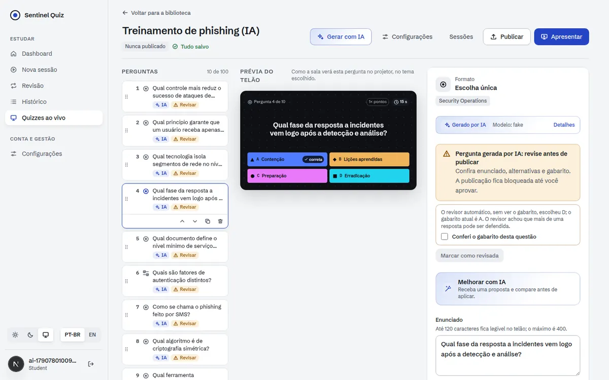
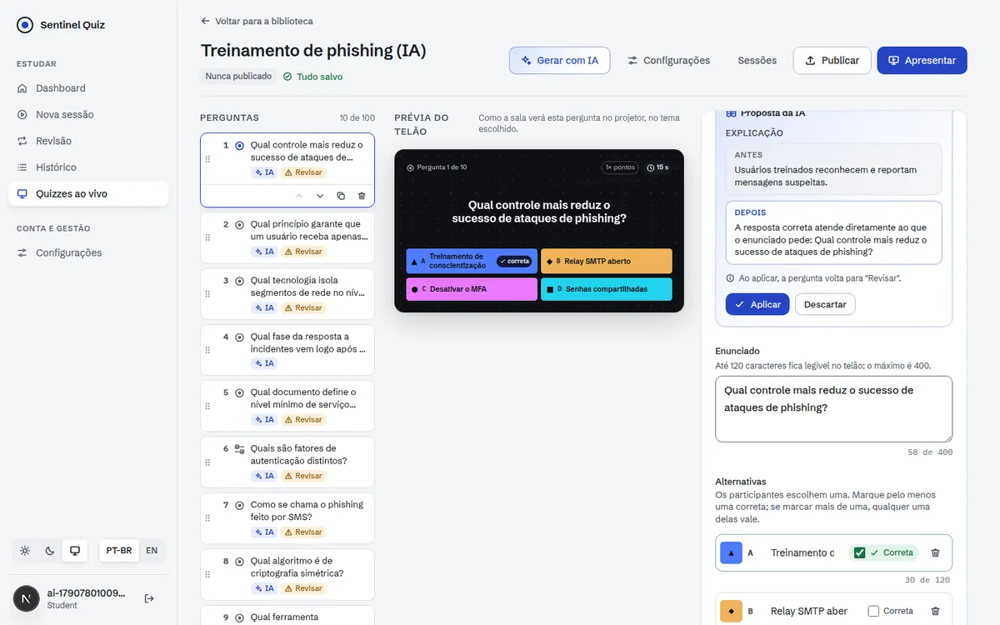

# Sentinel Arena: Incremento 2 (IA de criação)

Implementa a §12 do [plano](./PLANO.md) no escopo do MVP-0, sobre o [contrato](./CONTRATO-INCREMENTO-2.md).
Um instrutor descreve o tema, ou cola um texto, e recebe rascunhos de perguntas já checados por regras,
por deduplicação e por um revisor automático que resolve a questão **sem ver o gabarito**. Ele escolhe o
que entra, revisa cada pergunta e só então publica. Também pode melhorar uma pergunta existente ou sortear
questões do Banco sem usar IA.

## Telas

| | |
|---|---|
|  |  |
|  |  |
|  |  |

## O que foi entregue

### Backend
| Área | Arquivos | Destaques |
|---|---|---|
| Dados | `alembic/versions/0020_ai_authoring.py`, `models.py` | `ai_job` (fila), `ai_usage_ledger` (créditos), `live_quiz_item.origin_meta_json` (issues e revisor) e trilha de revisão (`reviewed_by_user_id`, `reviewed_at`) |
| API | `api/ai.py`, `schemas_ai.py`, `api/live.py` | `/api/ai/*` (capacidades, gerar por tema, gerar a partir de texto, melhorar item, jobs, aplicar, sugerir tempo) e `/api/live/bank/sample` |
| Pipeline | `services/ai_authoring/{prompts,guards,schemas,validators,dedupe,pipeline}.py` | Prompts versionados (`gen_items@v1`, `critic@v1`, `improve_item@v1`); conteúdo do usuário delimitado e tratado como dado; remoção de e-mail/CPF/telefone; sinal de prompt injection; validação item a item; regras determinísticas (§4 do contrato); deduplicação contra o Banco (inclui `personal_use`, que nunca é enviado à IA) e dentro do lote; revisor automático cego (`key_mismatch`, `ambiguous`, `factual_issue`) |
| Jobs e cotas | `services/ai_authoring/{jobs,quota,worker}.py` | Créditos reservados na criação e estornados pelo que não foi entregue; no máximo 2 jobs por usuário; executor em thread ou processo `ai-worker` (`SKIP LOCKED`); varredura de jobs travados; **modo degradado**: com a IA fora do ar, a geração sugere questões do Banco |
| Provedor | `services/ai_authoring/provider.py` | Gemini em modo JSON com retry/backoff e circuit breaker; provedor determinístico `fake` para dev e testes (recusado em produção) |
| Revisão | `services/live_quiz.py` | Itens de IA entram como `needs_review` e a publicação continua bloqueada; itens sinalizados pelo revisor exigem `confirm_key` |

### Frontend (`web/`)
- **Gerar com IA** (cabeçalho do editor, estado vazio e lista de perguntas): abas "Por tema", "A partir de um texto" e "Sortear do banco" (sem IA), indicador de créditos e custo antes de gerar.
- **Progresso em etapas** (Gerando → Validando → Revisão do crítico → Pronto), com cards-esqueleto. A janela pode ser fechada sem cancelar o job, e as gerações recentes ficam listadas.
- **Revisão dos rascunhos:** gabarito marcado com ícone e texto, "por que está errada" em cada alternativa, explicação, avisos e erros localizados, bloco do revisor automático com confiança, "Selecionar todos os válidos", "Adicionar mesmo assim" para rascunhos com erro, aviso de prompt injection e banner do modo degradado.
- **Editor:** selo "IA", bloco "Gerado por IA", checkbox "Conferi o gabarito desta questão" quando o revisor discordou, "Melhorar com IA" (reescrever, novos distratores, explicação) com comparação antes/depois, e "Sugerir tempo".
- Arquivos: `features/quiz-builder/components/ai/*`, `features/quiz-builder/lib/ai.ts`, `lib/api/ai-authoring.ts`, `lib/query/ai-hooks.ts`, i18n `quizAi` (pt-BR/en-US).

### Infraestrutura
- `APP_AI_*` no compose (ligado no stack de dev; **desligado em produção**), `ai-worker` no entrypoint, bucket de rate limit `ai` (6 criações/min por usuário).

## Como verificar

```bash
cd backend && python -m pytest -q tests/test_ai_authoring.py   # 18 testes da IA (suíte completa: 431)
cd web && npm run typecheck && npm run lint && npm test && npm run build

# Navegador real (API com AI_AUTHORING_ENABLED=true e AI_PROVIDER=fake, mais o web)
cd web && AI_SMOKE_OUT=/tmp/ai node scripts/ai-smoke.mjs
```

Evidências (30/09/2026):
- **Backend:** suíte completa verde. As migrações, incluindo a 0020, passaram em SQLite e PostgreSQL 16. O provedor Gemini foi testado com transporte HTTP simulado (JSON mode, retry em 503, 4xx sem retry).
- **Frontend:** typecheck, lint sem erros, 320 testes, build.
- **Navegador real sobre PostgreSQL:** gerar 10 perguntas → revisar rascunhos → adicionar → confirmar o gabarito do item sinalizado → melhorar a explicação → publicar, com créditos contabilizados (10 + 0,5). A partida ao vivo do Incremento 1 foi repetida sem regressão.

**Não verificado:** geração real com o Gemini, porque o ambiente não tem chave de API. O modelo padrão segue `GEMINI_MODEL`; o plano (E0.8) pede reavaliar custo e qualidade no sucessor do `gemini-2.5-flash` antes da produção.

Ajustes feitos durante a validação: o aviso de revisão espremia o texto no painel lateral (botão movido para baixo do aviso); os avisos misturavam o título em pt-BR com a mensagem técnica em inglês (agora só o texto localizado); o provedor de dev gerava "múltipla resposta" com uma só correta.

## Desvios do plano

| Plano | Incremento 2 | Motivo / próximo passo |
|---|---|---|
| Crítico em **outro modelo** | `AI_CRITIC_MODEL` configurável; vazio usa o mesmo modelo | Escolher o par de modelos no E0.8 |
| 3ª chamada de desempate em itens difíceis com `key_mismatch` | Não implementada; o item exige confirmação humana | Custo/benefício a medir no golden set |
| Dedupe com `pg_trgm` | Pré-filtro por tokens + `SequenceMatcher` em memória (cache por certificação) | Suficiente para ~3 mil questões; trocar se o banco crescer muito |
| F-IA2 com busca em linguagem natural | Sorteio determinístico por filtros e pesos do blueprint | NL → filtros depois |
| Selo "Gerado por IA" também para os participantes | Só no editor e no relatório de origem | Próximo incremento, junto com a configuração do owner |

## Próximos incrementos
1. Carga e resiliência: k6 com 1.000 participantes pelo nginx, fallback SSE, pausa/extensão de tempo, ensaio com bots.
2. Mais tipos (ordenar, numérica, nuvem de palavras), temas, som, controle remoto.
3. Self-paced, XLSX/PDF, insights de IA pós-sessão, claim de convidado, LGPD self-service.
4. PDF como fonte (MVP-1) e "Compartilhar com IA".
