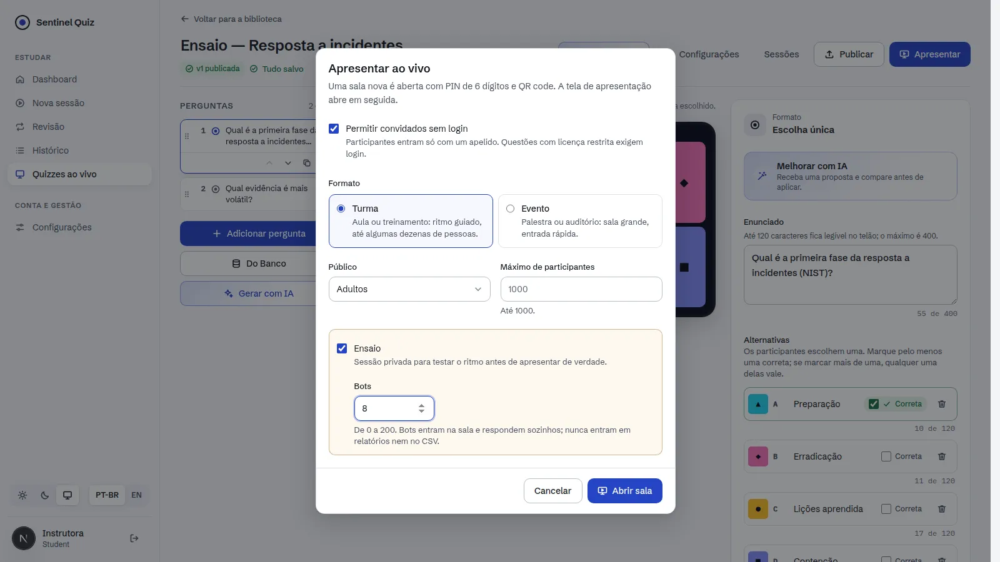
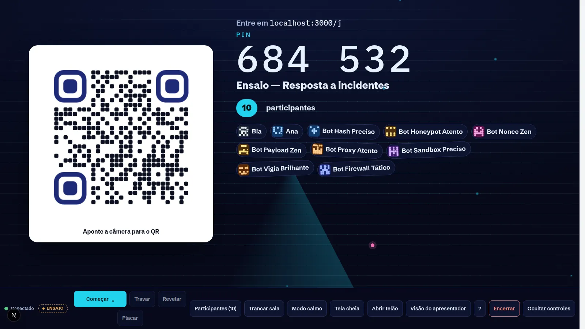
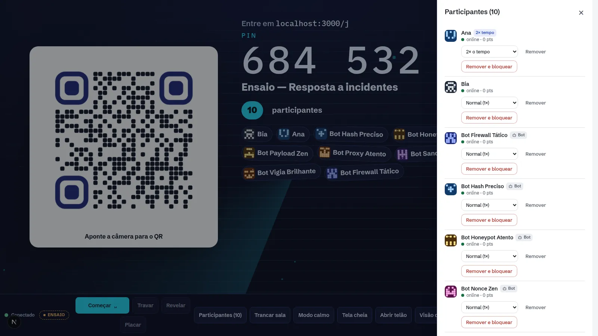
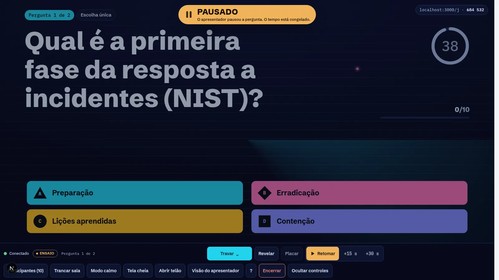
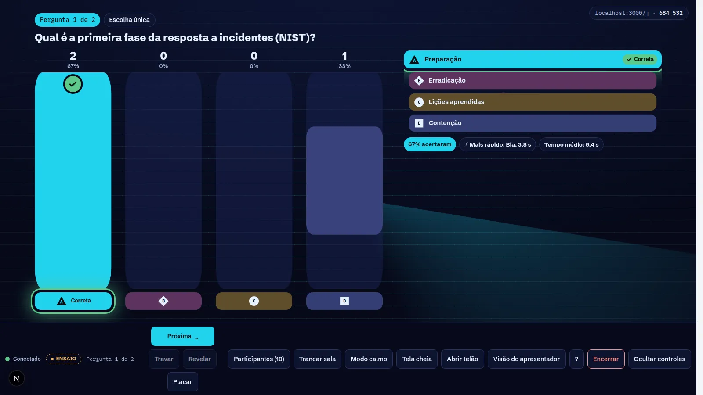
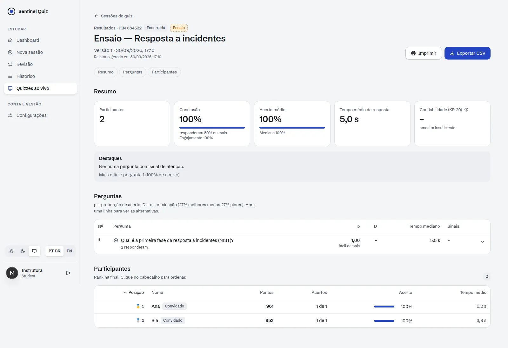
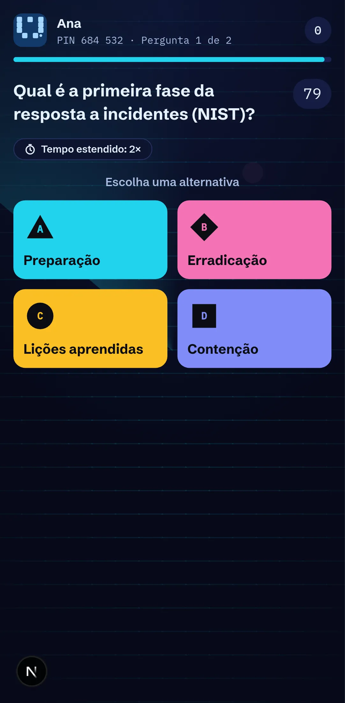
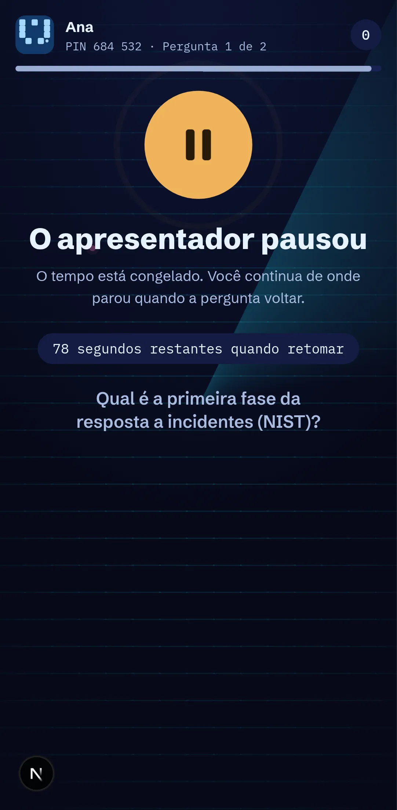
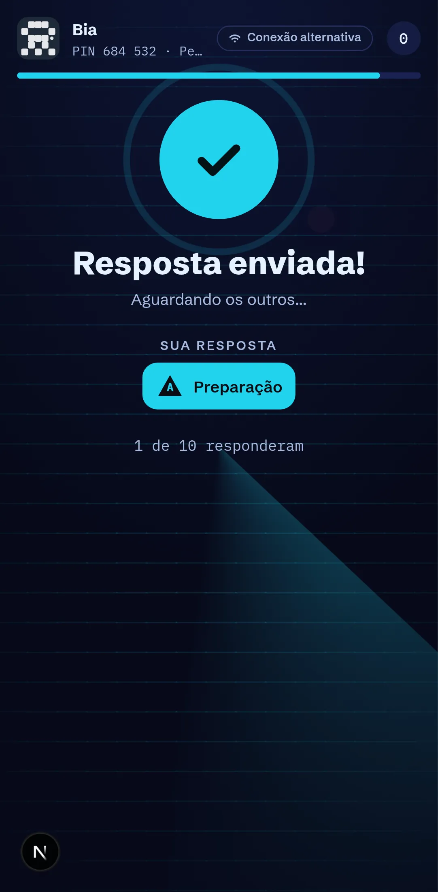

# Sentinel Arena: Incremento 3 (resiliência e operação ao vivo)

Fecha o MVP-0 do [plano](./PLANO.md) sobre o [contrato](./CONTRATO-INCREMENTO-3.md). O Arena agora aguenta
uma sala de 1.000 pessoas atrás do mesmo NAT, continua funcionando quando a rede bloqueia WebSocket e dá ao
apresentador o controle do tempo: pausar, retomar, estender e dar tempo extra a quem precisa. Também dá
para ensaiar com bots antes do evento.

## Telas

| | |
|---|---|
|  |  |
|  |  |
|  |  |

| | | |
|---|---|---|
|  |  |  |

## Teste de carga

Harness: `scripts/live/loadtest.py`. Um host e N participantes usam a API real (HTTP + WebSocket), todos do
mesmo IP. O roteiro é: tempestade de entradas, sockets, rajada de respostas em 2 s por pergunta, revelação,
relatório e "meus resultados" de todos ao mesmo tempo no fim. O harness confere cada meta do plano e sai com
código 1 se alguma falhar.

```bash
python scripts/live/loadtest.py --base http://127.0.0.1:8000 --participants 1000 --questions 5
```

Ambiente: 2 workers uvicorn, bus e rate limit em Redis, PostgreSQL 16, sem permessage-deflate, numa máquina
de **4 vCPU dividida com o próprio gerador de carga** (o plano pede geradores fora do host).

| Meta | Alvo | 1.000 participantes | 1.500 participantes |
|---|---|---|---|
| RNF-205 entradas de um único IP | 1.000 em 10 s, sem 429 | **4,9–6,2 s**, 0 × 429 | 7,9 s, 0 × 429 |
| RNF-204 rajada de respostas | 1.000 em 2 s sem erro | **5 × 1.000 aceitas** | 5 × 1.500 aceitas |
| RNF-103 aceite da resposta (servidor) | p95 ≤100 ms | **p95 ≤100 ms** (p50 25 ms) | p95 ≤100 ms |
| RNF-103 ack ponta a ponta | p95 ≤300 ms | p95 46–205 ms | p95 64–354 ms |
| RNF-106 revelação (broadcast no servidor) | ≤500 ms | p95 250–500 ms | p95 500 ms |
| Revelação personalizada até o último cliente | — | 160–433 ms | 470–905 ms |
| RNF-109 relatório | ≤1,5 s | 0,2–0,65 s | 0,2–1,0 s |
| "Meus resultados" de todos ao mesmo tempo | todos em ≤10 s | 1.000 em 5,5 s | 1.500 em 8,8 s |
| Erros no servidor | 0 | 0 | 0 |

**Onde estava o gargalo** (antes → depois, com 1.000):

| Problema | Correção | Efeito |
|---|---|---|
| Rate limit por IP (180/min) barrava a plateia atrás de um NAT | Buckets por código da sala e por token (DC-22), guarda por IP só contra PIN inválido | 25–30% de 429 → 0 |
| Cada resposta enviava `participant.progress` a todos (1.000 × 1.000 frames) e cada entrada disparava `lobby.update` e snapshot do host | Agregados no tick da sala (250/500 ms) | ack p50 23 s → 3,5 s |
| Uma transação e ~8 idas ao banco por resposta | *Group commit*: um `INSERT … ON CONFLICT DO NOTHING RETURNING` por lote, com ack depois do commit | ack p50 3,5 s → 25 ms |
| Snapshot recalculava o ranking inteiro a cada conexão | Ranking em cache por assinatura das respostas e do elenco, em *single flight* | conexões 44 s → 6 s |
| Relatório e "meus resultados" quadráticos | Uma passada pelas respostas; resultados pessoais usam o ranking em cache | relatório 1,9 s → 0,2 s |
| `Depends(get_db)` síncrono segurava a conexão até o teardown (pool esgotado sob rajada) | Rotas públicas quentes abrem e fecham a sessão dentro de uma única chamada ao threadpool | 7% de 500 → 0 |
| Um `PUBLISH` no Redis por resposta estourava o pool com 1.500 | Contadores marcados no máximo a cada 100 ms; pools Redis limitados e bloqueantes | 19 erros → 0 |
| Frames personalizados da revelação serializados no event loop | Montados no worker thread | revelação no servidor −50% |

## O que foi entregue

### Backend
| Área | Arquivos | Destaques |
|---|---|---|
| Rate limit | `middleware/rate_limit.py` | `live_room`, `live_token`, `live_cmd` e `live_ip`; `429 too_many_invalid_codes` só para códigos novos |
| Respostas | `live/runtime.py` (`submit_answers`), `live/gateway.py` (`AnswerBatcher`) | Lote com uma transação; idempotência entre lotes e entre processos |
| Ranking | `live/runtime.py` (`standings`) | Cache invalidado por contagem/máximo de eventos e pelo elenco; *single flight*; linhas só com colunas |
| Fallback | `live/sse.py`, nginx | `GET /api/live/sse` (mesmos frames) e `POST /api/live/cmd` sem estado (qualquer worker) |
| Tempo | `live/runtime.py`, `live/protocol.py` | `host.pause/resume/extend/set_time`; prazo e pontos por participante; auto-lock no maior prazo |
| Ensaio | `services/live_session.py`, `live/runtime.py` (`bot_plan`), gateway | Até 200 bots conduzidos pelo processo do host; fora dos relatórios |
| Observabilidade | `live/metrics.py`, `GET /api/live/metrics` | Prometheus ou JSON; lag do loop, aceite, broadcast, lotes, snapshots, conexões |
| Dados | `alembic/versions/0021_live_operations.py` | `paused_at`, `time_multiplier` (CHECK) e `is_bot` |
| Operação | `docker/entrypoint.sh`, compose, `.env*` | WebSocket sem deflate; novas variáveis documentadas |

### Frontend (`web/`)
- **Fallback de transporte** (`features/quiz-live/lib/live-fallback.ts`, `live-socket.ts`): se o socket não abre, ou cai duas vezes antes do `welcome`, o cliente passa para `EventSource` + `POST /cmd` com o mesmo tratador de frames. Aparece a pílula "Conexão alternativa". A API pública do socket não mudou.
- **Host:** Pausar/Retomar (tecla P), +15 s/+30 s (tecla +), estado "Pausado" no telão e na visão do apresentador; menu de tempo por participante (1×, 1,5×, 2×, sem limite) na gaveta de participantes, com selos de tempo e de bot; selo "Ensaio".
- **Participante:** tela de pausa com o tempo que sobra no prazo próprio, selo "Tempo estendido", contagem pelo prazo pessoal e resposta rejeitada durante a pausa com mensagem clara.
- **Apresentar:** opção "Ensaio" com número de bots (0 a 200); selo "Ensaio" na lista de sessões e no relatório.
- Strings em pt-BR e en-US; 36 testes unitários novos (fallback com `EventSource`/`fetch` simulados, cronômetro pausado e pessoal, reducer).

## Como verificar

```bash
cd backend && python -m pytest -q              # suíte completa
TEST_DATABASE_URL=postgresql+psycopg://… python -m pytest -q tests/test_migrations.py   # 0021 no PostgreSQL
cd web && npm run typecheck && npm run lint && npm test && npm run build
python scripts/live/loadtest.py --participants 1000   # API com LIVE_ENABLED=true e LIVE_HOST_POLICY=all
```

Evidências (30/09/2026):
- **Backend:** suíte completa verde (444 testes). Migração 0021 validada em SQLite e PostgreSQL 16.
- **Frontend:** typecheck, lint sem erros, 356 testes, build.
- **Navegador real** (`web/scripts/live-smoke-ops.mjs`, 11 verificações, sem erro de página, console ou HTTP), com 2 workers + Redis + PostgreSQL. O roteiro:
  - ensaio aberto pelo diálogo com 8 bots;
  - um celular com o WebSocket bloqueado (`routeWebSocket`) cai no SSE, vê a pausa e responde;
  - tempo 2× para uma participante;
  - pausa, retomada e +15 s;
  - relatório com 2 humanos e sem os bots.
- **Regressão:** a partida completa do Incremento 1 (`web/scripts/live-smoke.mjs`) passou sem erros.

Ajustes feitos durante a validação:
- Quem entrava por último aparecia "offline" para o host até a próxima mudança de estado. Agora a presença gravada atualiza o snapshot do host.
- A linha da gaveta de participantes espremia o nome ("A…"). Os controles foram para uma segunda linha.

## Desvios do plano

| Plano | Incremento 3 | Motivo / próximo passo |
|---|---|---|
| k6 em `load/k6/`, geradores fora do host e passando pelo nginx | Harness em Python no mesmo host, direto no uvicorn | Mede o servidor e roda no CI de desenvolvimento. O k6 externo com nginx vem antes do beta |
| Redis Lua (`accept.lua`) + stream + persister como caminho quente | *Group commit* no PostgreSQL com ack depois do commit (RPO 0) | Atinge as metas de 1.000 com menos peças. Reavaliar para 2.000 (GA) |
| Resume por delta (`last_seq`) | Reconexão sempre com snapshot (agora barato, com ranking em cache) | Delta junto com o Redis stream |
| Serviço `live` separado em produção | Mesmo processo da API (o app `app.live.main` existe, com os mesmos rate limits) | Separar quando a carga de REST competir com a sala |
| Pré-visualização como participante (RF-514) | Não implementada | Próximo incremento |
