# Sentinel Arena: Incremento 4 (moderação, direitos do participante e operação)

Fecha o código do MVP-0 do [plano](./PLANO.md) (§17.2), sobre o [contrato](./CONTRATO-INCREMENTO-4.md).
Salas abertas a convidados passam a ter moderação de ponta a ponta:
- filtro de termos gerido pelo admin;
- revisão do conteúdo na publicação;
- denúncia pelo participante;
- fila de moderação no admin, que pode remover um item de uma sala em andamento.

Os participantes veem e excluem os próprios dados e podem salvar o resultado na conta.
O apresentador ganha checagem pré-evento, prévia do celular no ensaio e aviso de lotação.
O incremento também passou por endurecimento: teste de carga pelo nginx de produção, testes de caos e revisão de
segurança.

## Telas

| | |
|---|---|
| 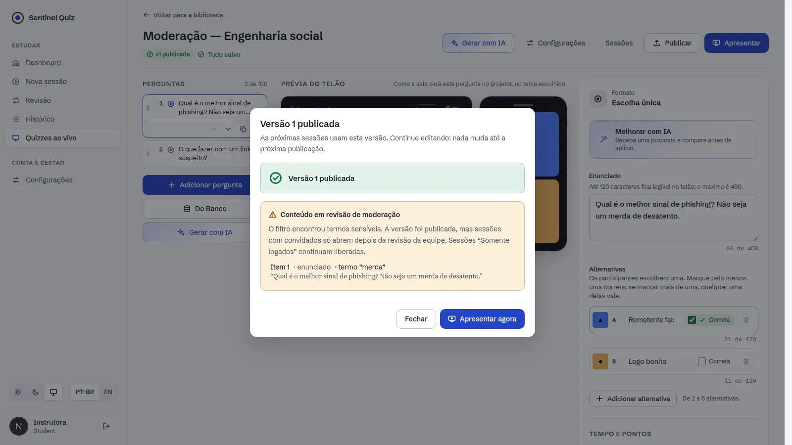 | 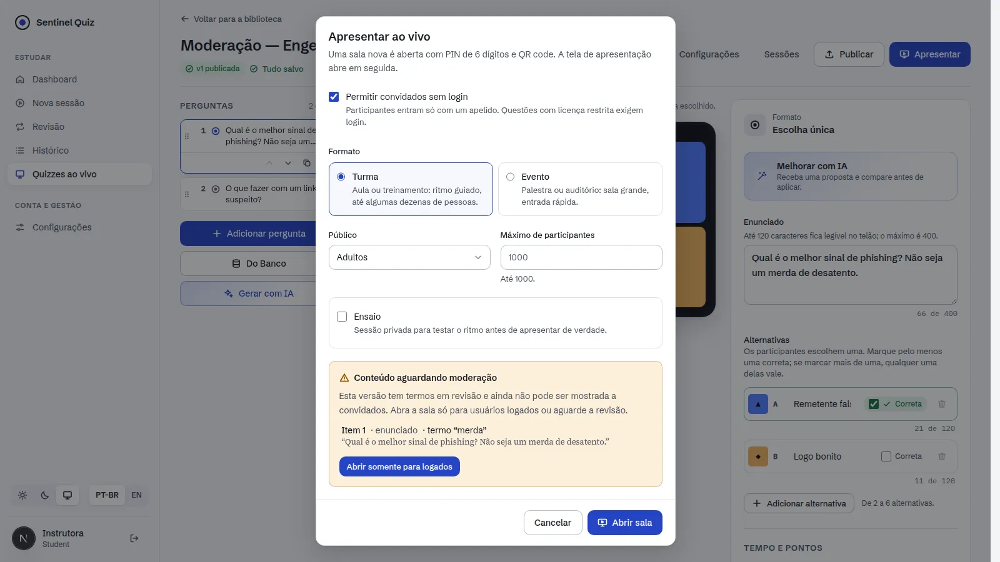 |
| 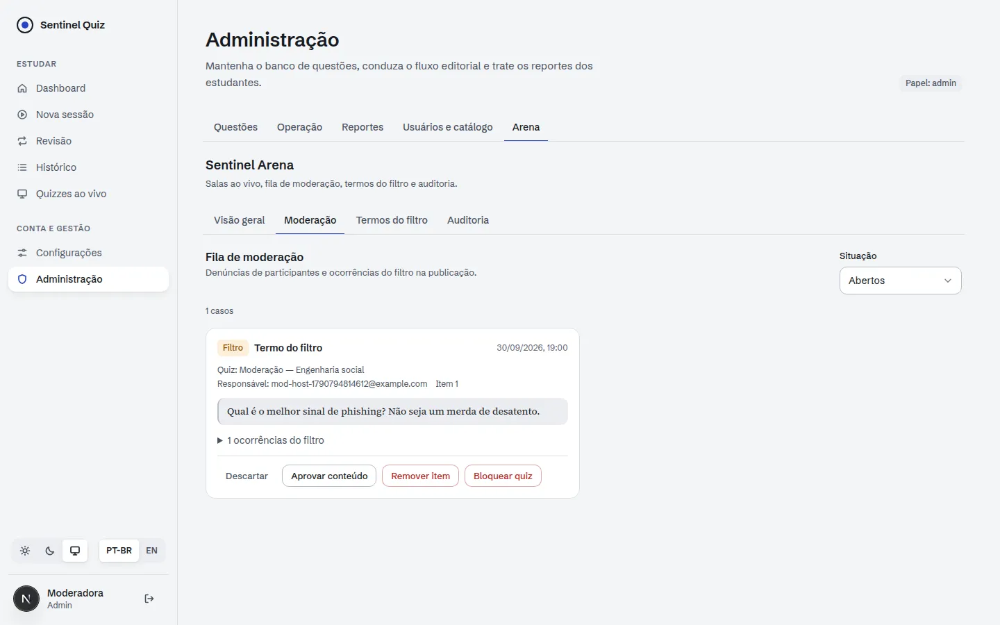 | 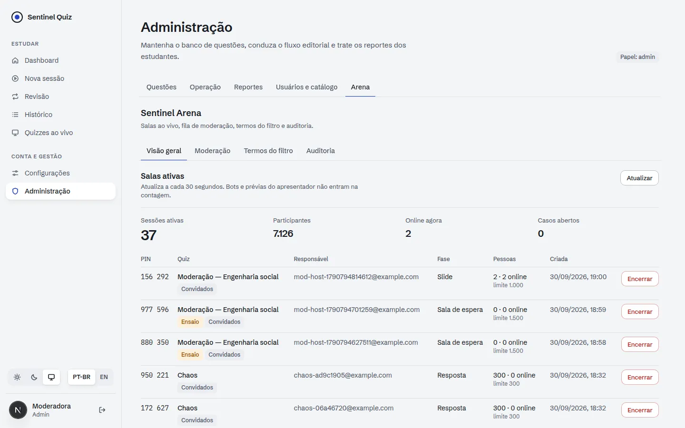 |
| 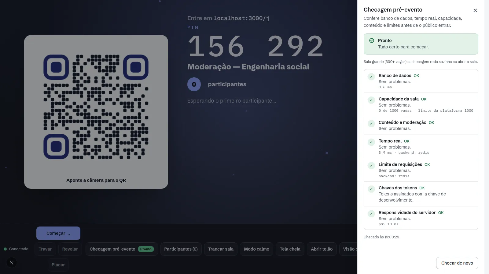 | 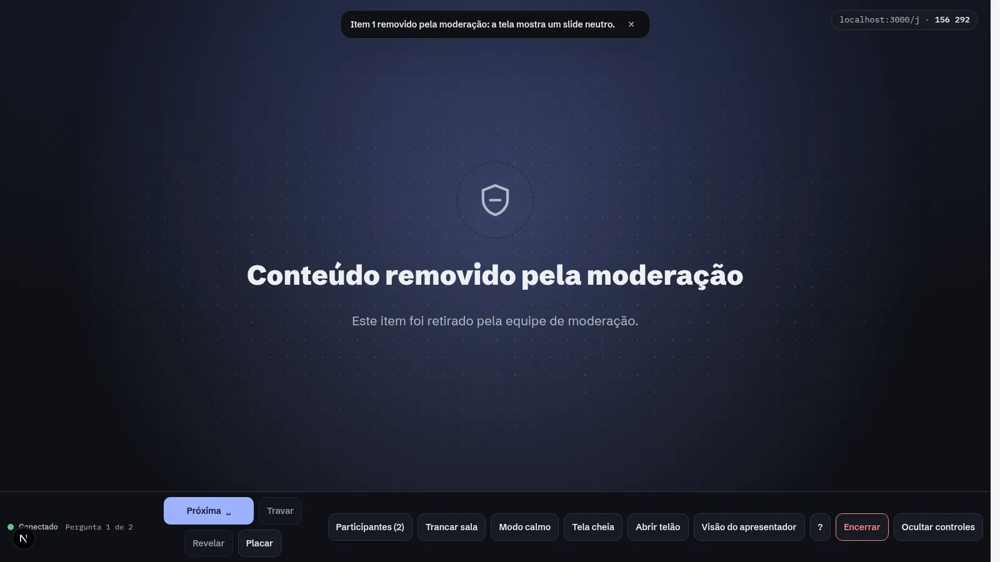 |
| 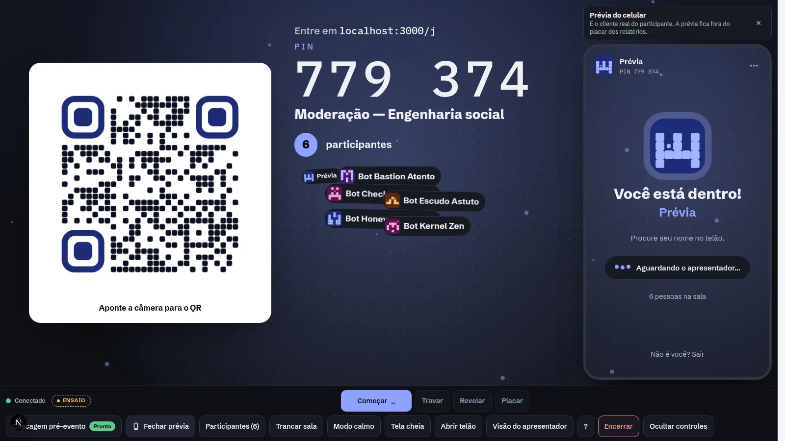 | |

| | | |
|---|---|---|
| 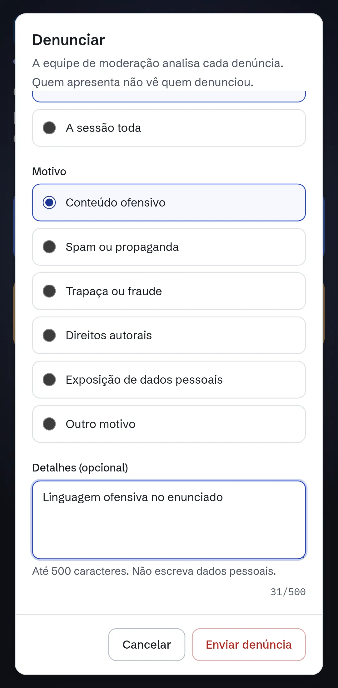 | 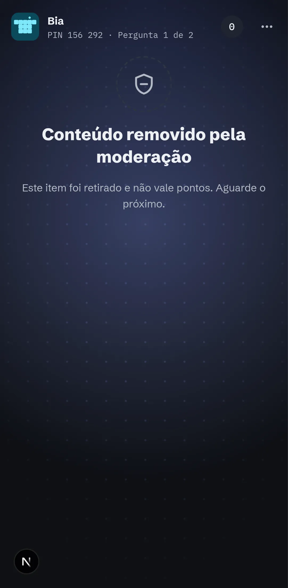 | 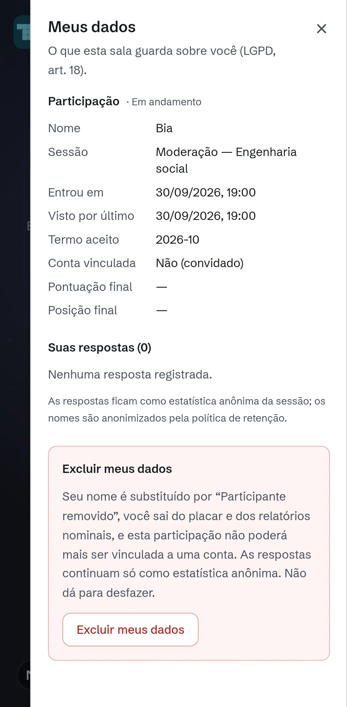 |
| 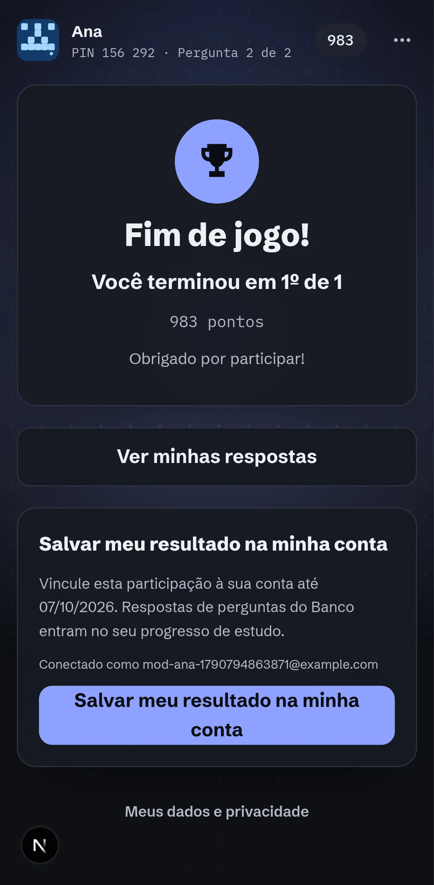 | 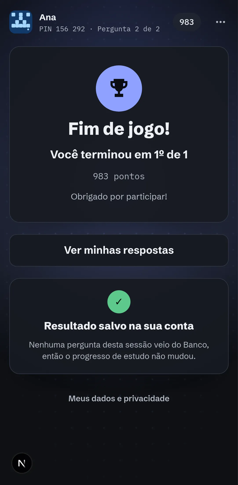 | |

## O que foi entregue

### Backend
| Área | Arquivos | Destaques |
|---|---|---|
| Dados | `alembic/versions/0022_live_moderation.py` | Termos, casos de moderação e trilha de auditoria. Estado de moderação da versão, quiz bloqueado, itens ocultos por sessão, colunas de retenção, prévia, exclusão e claim |
| Moderação | `services/live_moderation.py`, `services/live_admin.py` | Termos `block`/`allow` para nomes e conteúdo, válidos em ≤30 s sem deploy (RF-1107). Varredura na publicação: versão `flagged` não vai para convidados até aprovação (RF-1112). Denúncia com cópia do item (RF-1104). Fila com aprovar, remover item de salas abertas, encerrar sessão e bloquear quiz (RF-1114). Respostas digitadas ofensivas mascaradas no telão |
| Admin | `api/live_admin.py` | Visão geral (RF-1102), encerramento forçado com motivo (RF-1103), casos, termos, auditoria. Relatório de outro owner só com motivo (RF-1110). Execução manual da retenção. Moderador (`reviewer`) opera a fila; ações destrutivas exigem `admin` |
| Direitos | `services/live_rights.py`, `api/live.py` | `GET`/`DELETE /me`: ver e anonimizar (RF-650). `/me/access`: token novo com nome + código de retorno, com limite de tentativas. `/me/claim` até 7 dias após o fim; respostas do Banco entram no progresso de estudo (RF-633) |
| Operação | `services/live_preflight.py`, `services/live_retention.py`, `live/runtime.py` | Checagem pré-evento (RF-1115). Lotação no snapshot do host (RF-1205). Prévia do participante no ensaio (RF-514). Job `live-cleanup`: anonimiza nomes, congela o relatório e só então expurga as respostas (RF-1109) |
| Auditoria | `live_audit_event` | Encerramentos, decisões da fila, termos, visualização e export de relatório nominal, exclusão, claim e retenção |

### Frontend (`web/`)
- **Celular:** menu "⋯" com "Denunciar" (sessão ou pergunta atual) e "Meus dados" (respostas e exclusão com confirmação). Acesso por código de retorno quando o token expira ou a sessão acabou; a identidade (sem segredo) fica guardada por 30 dias. Cartão "Salvar meu resultado na minha conta" ao fim, com ida e volta pelo login.
- **Apresentador:** pílula de lotação a 80%. Painel "Checagem pré-evento", automático a partir de 300 vagas. "Prévia do celular" no ensaio, com o cliente real do participante montado ao lado do telão. Slide neutro e aviso quando um item é removido.
- **Editor:** achados da moderação após publicar. O diálogo de apresentar explica `moderation_pending` (com a opção "somente logados") e `quiz_blocked`.
- **Admin, aba "Arena":** visão geral com encerramento, fila de moderação com ações por papel, termos do filtro e auditoria.
- **Relatório:** aviso quando mostra o retrato congelado pela retenção.

### Infraestrutura
- `docker/nginx/nginx.conf` substitui o padrão da imagem: 16.384 conexões por worker e limite de 65.535 arquivos. O padrão (1.024) travava uma sala abaixo de ~1.000 sockets. O compose define `nofile` para o proxy.
- Comando `live-cleanup` no entrypoint, para rodar uma vez por dia.

## Endurecimento

**Carga pelo nginx de produção** (TLS, headers e limites reais; 2 workers + Redis): 1.000 entradas de um IP em ~6 s, sem 429. 5 × 1.000 respostas aceitas, ack p95 no cliente entre 62 e 156 ms. O nginx gastou ~4 s de CPU por worker em duas rodadas completas. A conexão lenta dos 1.000 sockets (~40 s) vem dos handshakes TLS do gerador em Python.

**Caos** (`scripts/live/chaos.py`, 300 participantes):

| Cenário | Resultado |
|---|---|
| `kill -9` de um worker no meio da pergunta | 243–258 sockets caíram; todos voltaram em ≤2,8 s (p95 2,5–2,7 s, RNF-302); 300/300 acks, respostas gravadas e revelação entregue. O uvicorn recriou o worker |
| Reinício do Redis no meio da pergunta | Na primeira execução, **a revelação não chegou a ninguém**: o bus ficava preso. Corrigido com retry no publish (~1,7 s), reconstrução do pub/sub com nova inscrição nas salas e ressincronização (snapshot para todos os sockets locais e auto-lock relido do banco). Depois disso: 300/300 acks, gravadas e reveladas (RNF-305) |

**Revisão de segurança** da branch inteira: nenhuma vulnerabilidade com confiança alta. Pontos corrigidos durante o
incremento:
- Teto de 50 denúncias abertas por sessão, contra inundação da fila.
- Código de sala já alcançado pelo IP não conta como tentativa de adivinhação, para uma turma inteira recarregando a
  sala encerrada não bloquear o NAT.
- "Meus dados" não mostra se a pergunta aberta está certa antes da revelação.
- O token do claim vai no corpo, porque o header `Authorization` é da conta.
- A rota `/api/live/me` sem barra final estava fora do bucket por token.

## Como verificar

```bash
cd backend && python -m pytest -q                       # 458 testes
TEST_DATABASE_URL=postgresql+psycopg://… python -m pytest -q tests/test_migrations.py   # 0022 no PostgreSQL
cd web && npm run typecheck && npm run lint && npm test && npm run build
cd web && LIVE_SMOKE_MAKE_ADMIN="psql … -c \"UPDATE users SET role='admin' WHERE email='{email}'\"" node scripts/live-smoke-moderation.mjs
python scripts/live/loadtest.py --base https://127.0.0.1:8443 --metrics-base http://127.0.0.1:8000 --insecure --participants 1000
python scripts/live/chaos.py --scenario worker --supervisor-pid <pid do uvicorn>
python scripts/live/chaos.py --scenario redis
```

Evidências (30/09/2026):
- **Backend:** suíte completa verde. A migração 0022 passou em SQLite e PostgreSQL 16.
- **Web:** typecheck, lint sem erros, 407 testes, build.
- **Navegador real, sem erro de página, console ou HTTP:**
  - `live-smoke-moderation.mjs`: 13 verificações, de conteúdo sinalizado a claim e prévia do ensaio.
  - `live-smoke-ops.mjs` (Incremento 3): 11 verificações.
  - `live-smoke.mjs` (Incremento 1): partida completa.

Ajustes feitos durante a validação:
- A CHECK nova em `live_quiz_version` reconstruía a tabela no SQLite e quebrava a ordem das cascatas; ela agora só é
  criada no PostgreSQL.
- O identificador da sessão do participante vivia só no `sessionStorage`, e o claim falhava depois de fechar a aba.

## Desvios do plano

| Plano | Incremento 4 | Motivo / próximo passo |
|---|---|---|
| RF-1112 com 2ª camada de classificação por IA | Só o filtro de termos (alto recall, sempre com revisão humana) | Ligar a classificação quando o custo for medido no golden set |
| RF-1113 moderação de imagens | Não se aplica ainda | O editor não aceita upload de mídia |
| Função SQL auditada `live_purge_events` | Expurgo em Python, auditado em `live_audit_event` | Mesmo efeito; migrar para `SECURITY DEFINER` com o papel `sentinel_app` (DC-25) |
| Pedido de dados mediado pelo owner, sem código de retorno | Só com token ou código de retorno | Fluxo de protocolo manual no próximo incremento |
| Alerta no canal de plantão (RF-1115) | Log `live_preflight_failed` como gancho | Ligar no Alertmanager (RNF-1003) |
| k6 com geradores fora do host | Harness Python pelo nginx, no mesmo host | O servidor tem folga (nginx ~4 s de CPU por rodada); k6 externo no game day |
| Desbloqueio de quiz e admin vendo relatório de outro owner na UI | Só na API | Telas na próxima iteração do admin |

## O que falta para o beta fechado (critérios da §17.2)

Código do MVP-0: completo. Fora do código:
1. Validação jurídica da LGPD.
2. Auditoria de licença do banco (E0.1, com SME).
3. Game day de operação (§17.7), com k6 externo.

Depois vem o **MVP-1 (GA)**:
- self-paced;
- tipos ordenar, numérica e nuvem de palavras;
- mais 3 temas;
- IA a partir de PDF;
- colaboração;
- controle remoto;
- 2.000 por sala.
