# Sentinel Arena: Incremento 5 (ordenar, resposta numérica e nuvem de palavras)

Primeiro passo do MVP-1 (GA) do [plano](./PLANO.md), sobre o [contrato](./CONTRATO-INCREMENTO-5.md). A Arena ganha os
tipos T05 (ordenar), T06 (resposta numérica) e T08 (nuvem de palavras), de ponta a ponta:
- editor;
- celular;
- telão;
- visão do apresentador;
- relatório;
- "meus resultados";
- ensaio com bots.

As PBQs do Banco que têm uma tarefa de ordenação adequada entram no quiz como itens de ordenar.

## Telas

| | |
|---|---|
|  | 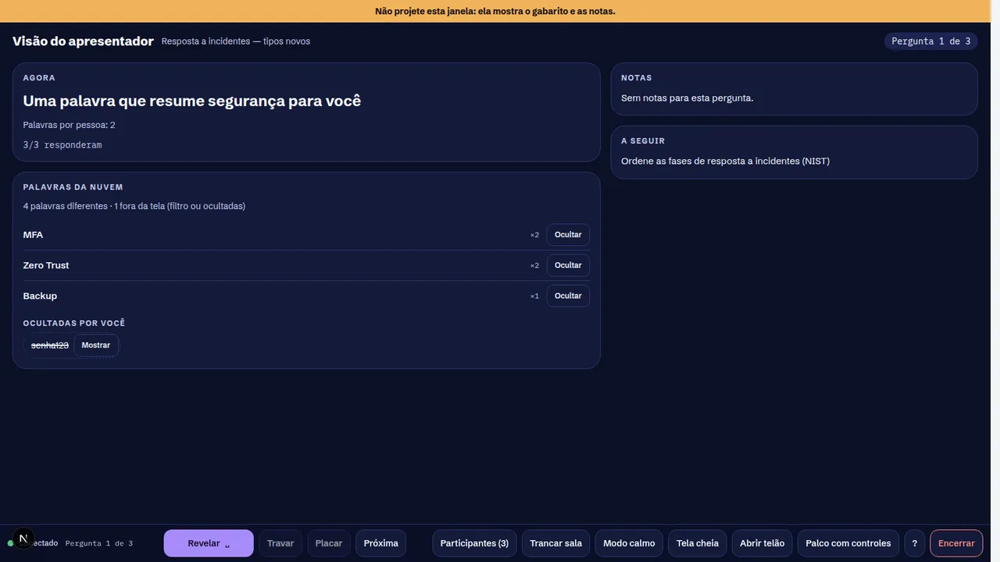 |
| 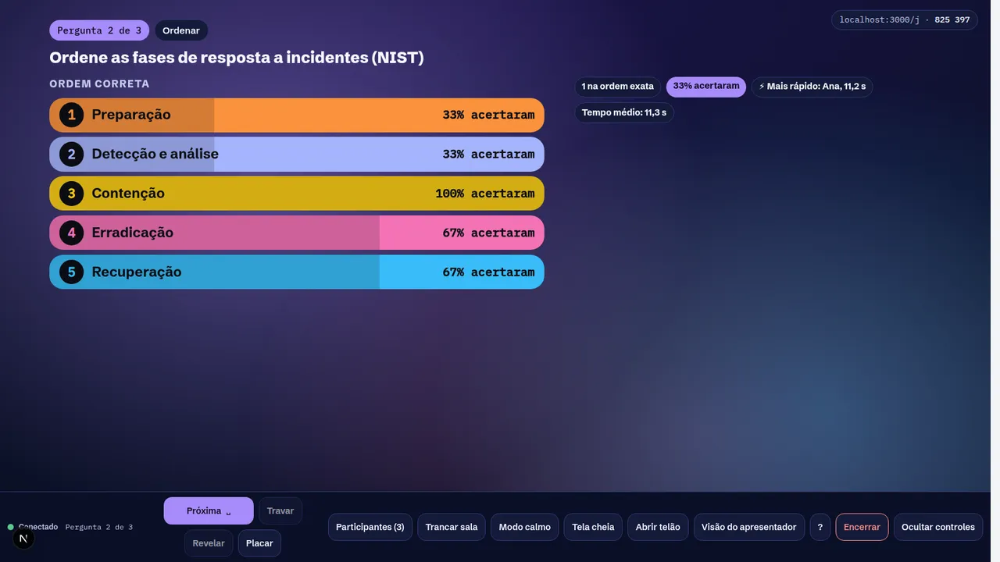 | 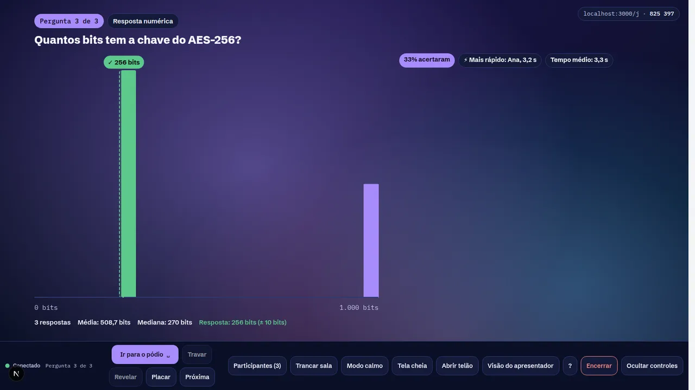 |
| 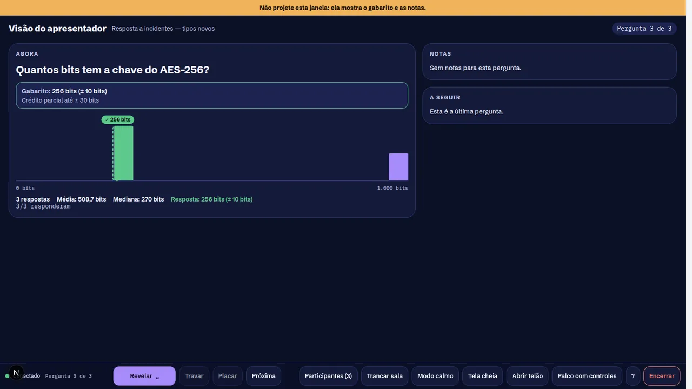 |  |
| 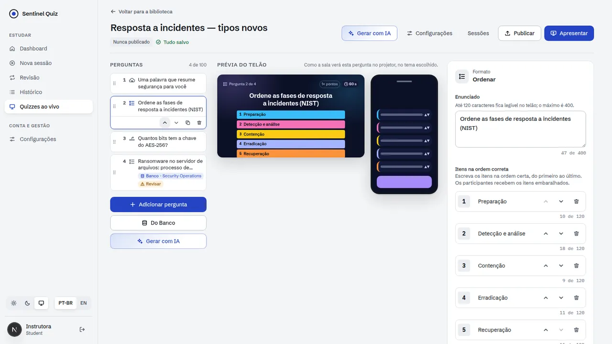 |  |
| 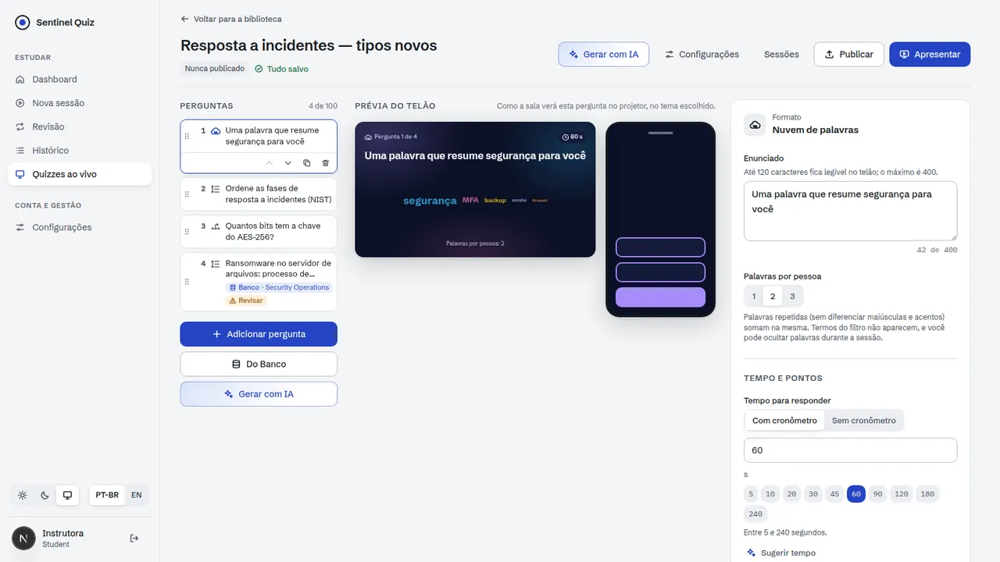 | 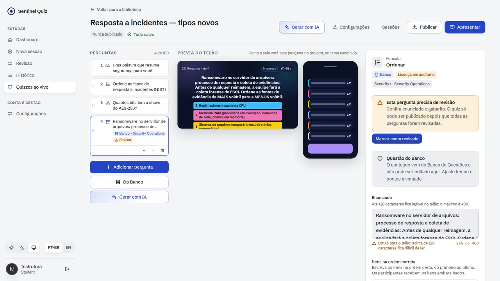 |
| 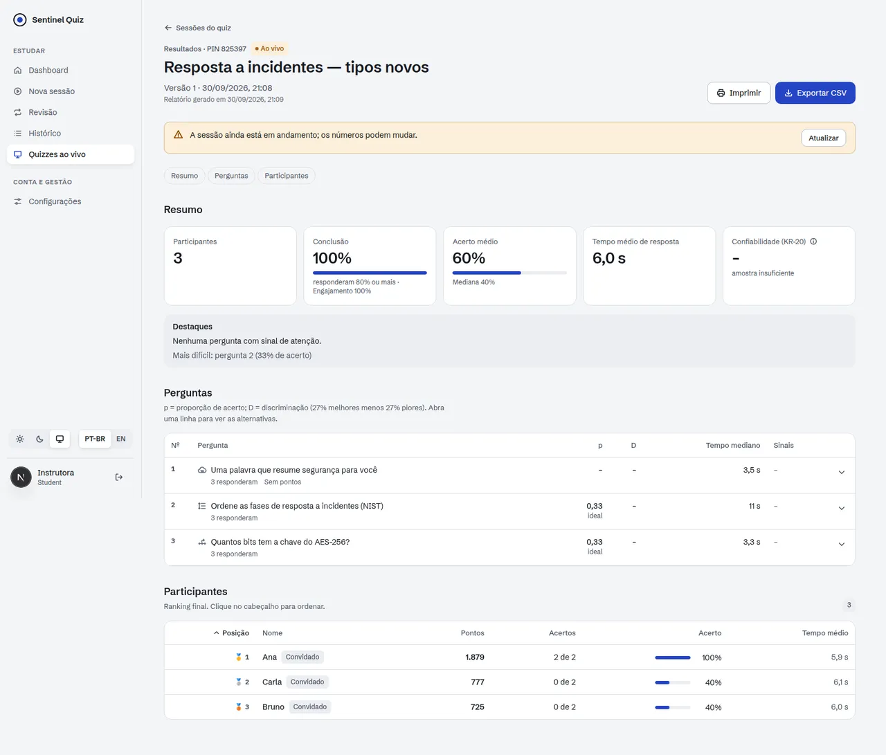 | |

| | | |
|---|---|---|
| 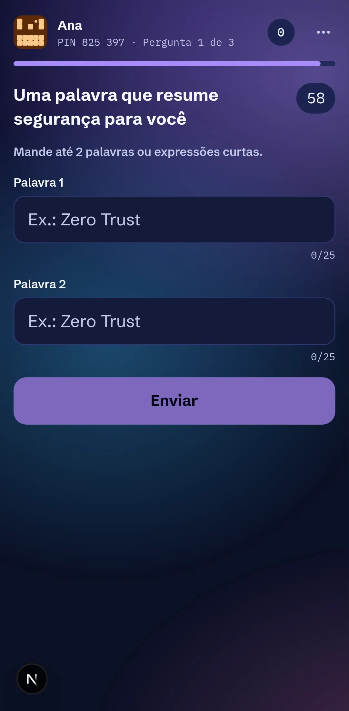 | 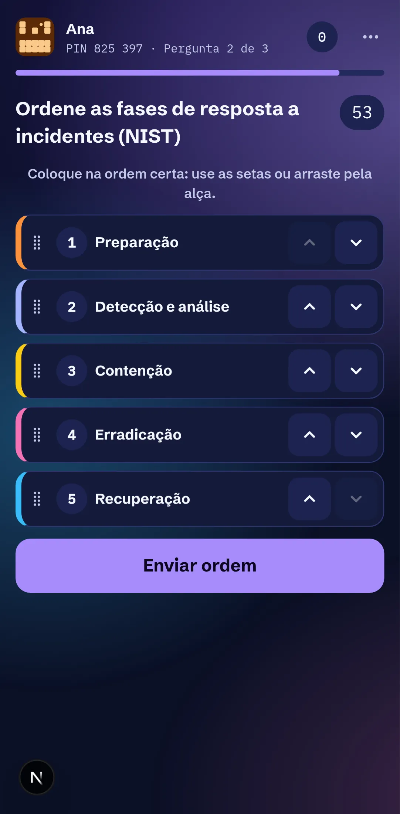 | 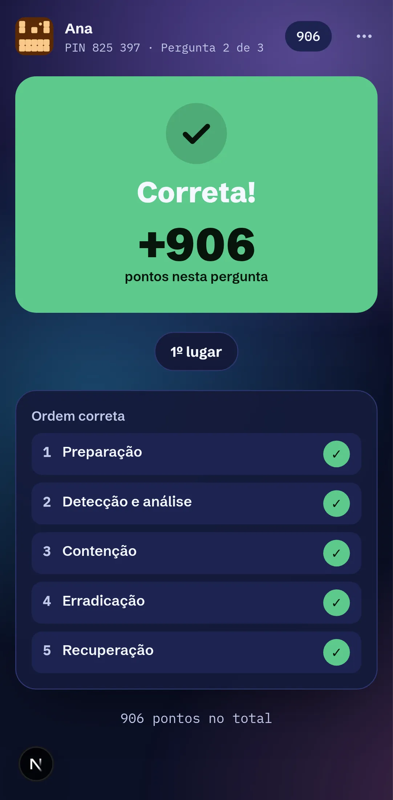 |
| 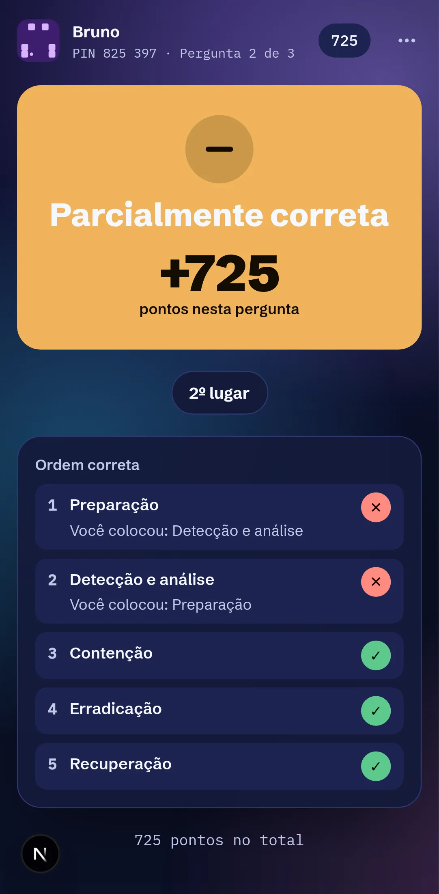 | 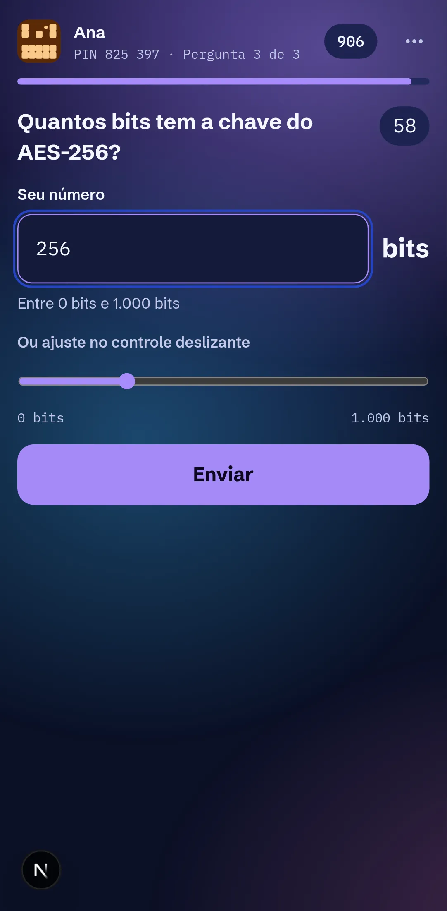 | 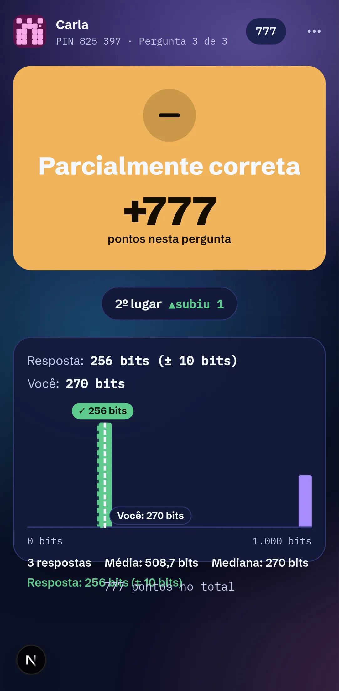 |
|  | | |

## O que foi entregue

### Backend
| Área | Arquivos | Destaques |
|---|---|---|
| Dados | `alembic/versions/0023_live_ga_item_types.py` | A CHECK de `item_type` aceita os três tipos (uma reconstrução da tabela no SQLite). Coluna nova `live_session.hidden_words` |
| Tipos | `services/live_items.py` | **Ordenar:** 3 a 6 itens; a ordem do autor é a correta. Embaralhamento por sessão que nunca mostra a ordem certa. Kendall (parcial) ou exata. **Numérica:** faixa, passo, unidade, valor e tolerância, com crédito linear até 3× a tolerância. **Nuvem:** 1 a 3 palavras de até 25 caracteres, deduplicadas por pessoa, sem pontuação |
| Protocolo | `live/protocol.py`, `live/gateway.py` | `answer.submit` ganha `words[]` e `number`, que o celular lê no idioma da pessoa. Assim "1.005" nunca é ambíguo. Comando novo `host.hide_word` |
| Sala | `live/runtime.py` | **Ao vivo:** nuvem no telão; histograma de 20 faixas para o host. **Revelação:** ordem correta com acerto por posição; valor, tolerância, média e mediana. A nuvem mostra as 60 palavras do topo, sem as barradas pelo filtro de termos nem as ocultadas pelo host. **Também:** "não mostrar a resposta no celular" esconde a ordem e o valor; bots do ensaio respondem os três tipos |
| Resultados | `services/live_results.py` | Relatório com ordem correta e acerto por posição, histograma e valor, e palavras (as ocultadas vêm marcadas). CSV. "Meus resultados" mostra a ordem enviada, "275 bits" ou as palavras, junto com o gabarito |
| Banco | `services/live_quiz.py` | PBQ com tarefa de ordenação de 3 a 6 itens (até 120 caracteres) vira `ordering`, com o método e a explicação da tarefa. No conjunto Security+ atual, 1 das 6 PBQs se encaixa |

### Frontend (`web/`)
- **Editor:**
  - Ordenar: itens na ordem certa, com ↑/↓, e escolha entre Kendall e exata.
  - Numérica: aceita "1.234,5" em pt-BR e valida na hora.
  - Nuvem: palavras por pessoa.
  - Prévia do telão para os três tipos; PBQs do Banco aparecem como "Ordenar".
- **Celular:**
  - Ordenar com botões ↑/↓ obrigatórios (WCAG 2.5.7), anúncio da nova posição e arraste opcional pela alça.
  - Numérica com campo decimal no idioma da interface, controle deslizante sincronizado e erro antes de enviar.
  - Nuvem com um campo por palavra e contador.
  - A tela de resposta enviada e a revelação mostram o que a pessoa mandou.
- **Telão e apresentador:**
  - Nuvem com layout determinístico e sem dependência nova, mais uma lista para leitores de tela.
  - Histograma com faixa de tolerância, média e mediana.
  - Revelação da ordem com transição FLIP; sem animação quando o sistema pede movimento reduzido.
  - Lista "Ocultar/Mostrar" de palavras, alimentada pelo servidor, que funciona de qualquer aparelho.
- **Relatório:** blocos dos três tipos.
- Textos em pt-BR e en-US, com 59 testes novos.

## Validação

**Carga** com 1.000 participantes, 2 workers e Redis (`loadtest.py --item-type`, novo):

| Tipo | Respostas aceitas | ack p95 | Revelação para todos | Relatório |
|---|---|---|---|---|
| Nuvem de palavras | 2 × 1.000/1.000 | 118–179 ms | ≤ 516 ms | 151 ms |
| Numérica | 2 × 1.000/1.000 | 93–215 ms | ≤ 502 ms | 128 ms |
| Ordenar | 2 × 1.000/1.000 | 43–58 ms | ≤ 559 ms | 374 ms |

O filtro de termos da nuvem passava por todas as palavras distintas a cada atualização (~35 ms com 800 palavras). Ele
agora para quando as 60 palavras visíveis estão preenchidas (~11 ms).

```bash
cd backend && python -m pytest -q                       # 470 testes (12 novos em test_live_ga_types.py)
TEST_DATABASE_URL=postgresql+psycopg://… python -m pytest -q tests/test_migrations.py   # 0023 no PostgreSQL
cd web && npm run typecheck && npm run lint && npm test && npm run build
cd web && node scripts/live-smoke-ga.mjs
python scripts/live/loadtest.py --participants 1000 --item-type word_cloud   # também numeric e ordering
```

Evidências (30/09/2026):
- **Backend:** suíte completa verde. A migração 0023 passou em SQLite e PostgreSQL 16.
- **Web:** typecheck, lint sem erros, 466 testes, build.
- **Navegador real, sem erro de página, console ou HTTP:**
  - `live-smoke-ga.mjs`: 9 verificações.
    - PBQ do Banco importada como ordenar.
    - Nuvem ao vivo no telão; palavra ocultada pelo apresentador some do telão e fica disponível para "Mostrar".
    - Ordem montada só com os botões.
    - "1.000" lido como mil.
    - Relatório com a palavra ocultada marcada.
  - `live-smoke.mjs` (Incremento 1) e `live-smoke-ops.mjs` (Incremento 3): continuam verdes.

Ajustes feitos durante a validação:
- **Números:** "523.456" é ambíguo entre pt-BR e en-US. Os bots e o celular passaram a mandar `number` em JSON, e o
  texto ficou só como alternativa.
- **Palavras ocultas:** o host não recebia a lista de volta. Ela agora vem no `word_cloud.update` do host e no
  snapshot do apresentador.
- **Busca no Banco:** mostra o mesmo enunciado que o item importado terá.
- **Média no telão:** aparecia com 4 casas ("508,6667"); agora usa as casas que a faixa pede.

## Desvios do plano

| Plano | Incremento 5 | Motivo / próximo passo |
|---|---|---|
| Nuvem com agrupamento de sinônimos | Agrupa só maiúsculas, acentos e espaços | Agrupamento semântico depois, com IA opcional e revisão do host |
| PBQs com as outras tarefas (categorizar, associar, tabela) | Só ordenação | Não cabem num item ao vivo curto. Ficam no modo de estudo |
| Numérica com gráfico de enxame (beeswarm) | Histograma de 20 faixas | Lê bem com 1.000 respostas. O enxame fica como opção de tema |
| Enunciado da PBQ importada | "título: tarefa", às vezes acima de 120 caracteres | O editor avisa, e o autor encurta na revisão, que a PBQ já exige |
| Self-paced (E1.10) | Não entrou | Próximo incremento |

## Próximos passos (MVP-1)
1. Self-paced (E1.10).
2. Mais 3 temas.
3. IA a partir de PDF.
4. Colaboração.
5. Controle remoto.
6. 2.000 participantes por sala.
