# Sentinel Arena: Incremento 6 (desafio self-paced)

Segundo passo do MVP-1 (GA) do [plano](./PLANO.md): a jornada J5 e os requisitos RF-801 a RF-813 e RF-1029, sobre
o [contrato](./CONTRATO-INCREMENTO-6.md). Um quiz publicado vira um **desafio com link permanente**
(`/q/{slug}`). Cada pessoa responde no próprio ritmo até o prazo, e o owner acompanha um painel com funil e
ranking.

## Telas

| | |
|---|---|
| 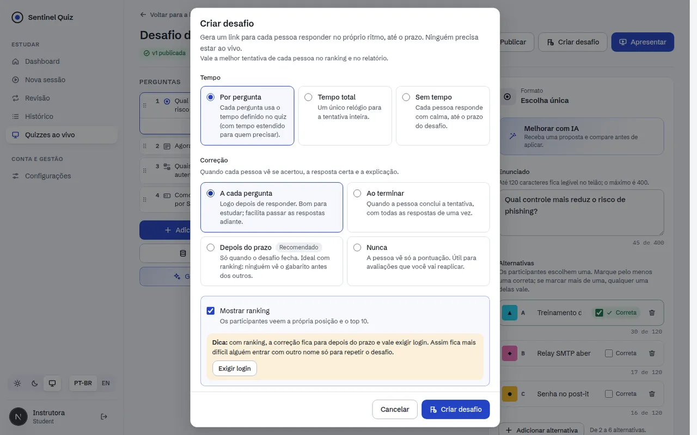 | 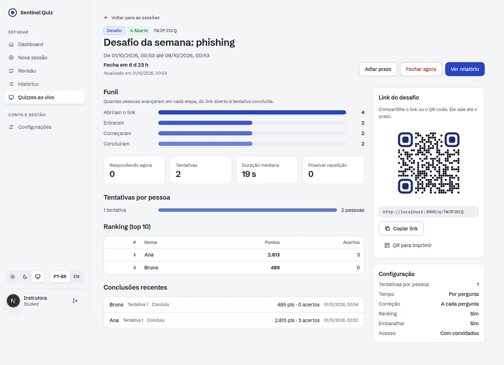 |
| 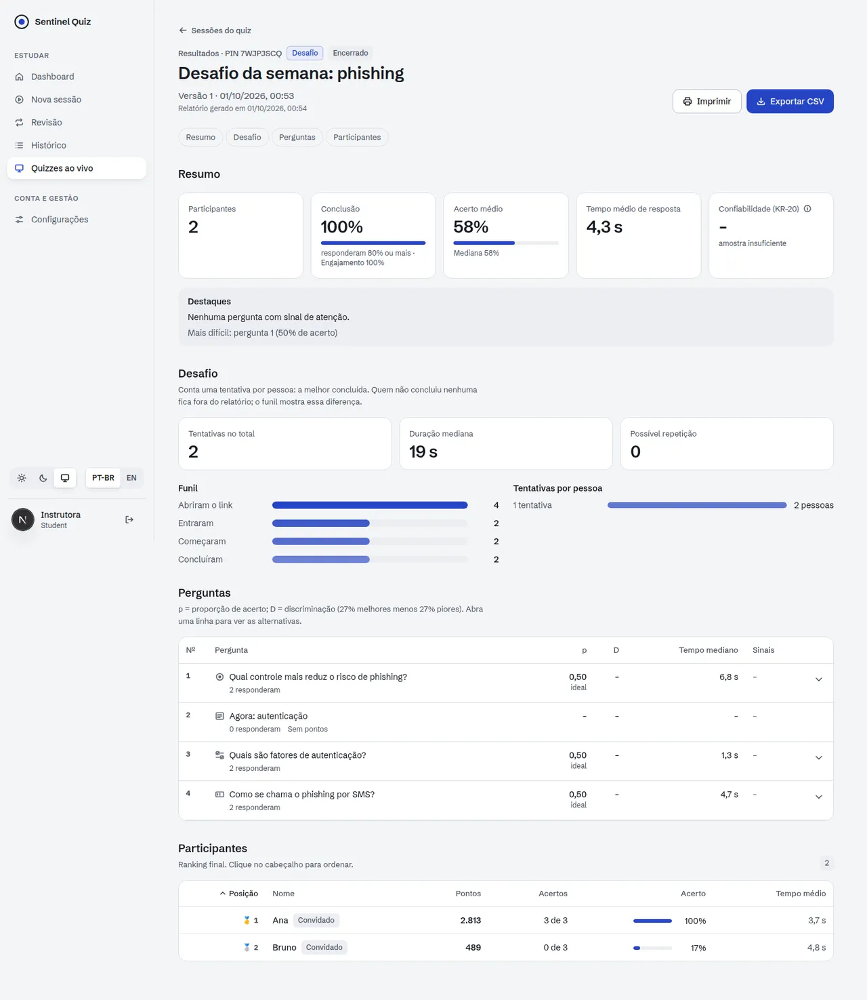 | 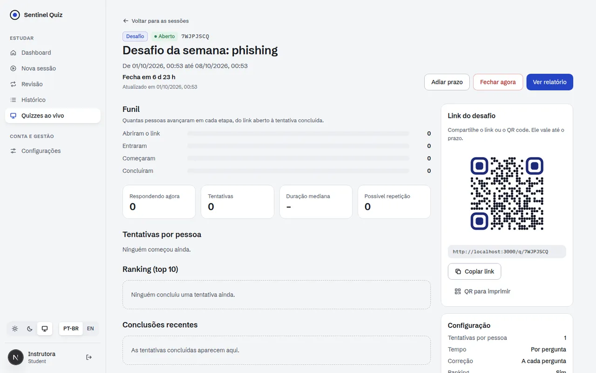 |

| | | |
|---|---|---|
| 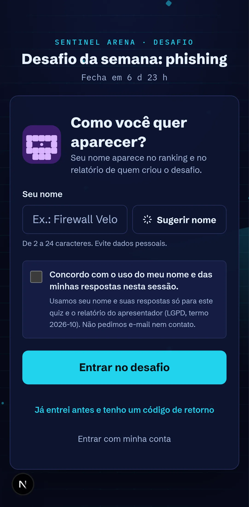 | 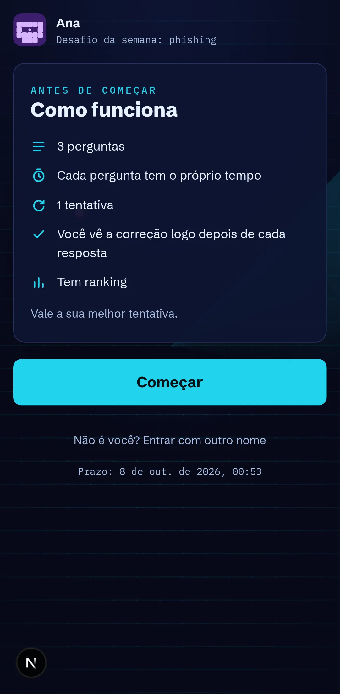 | 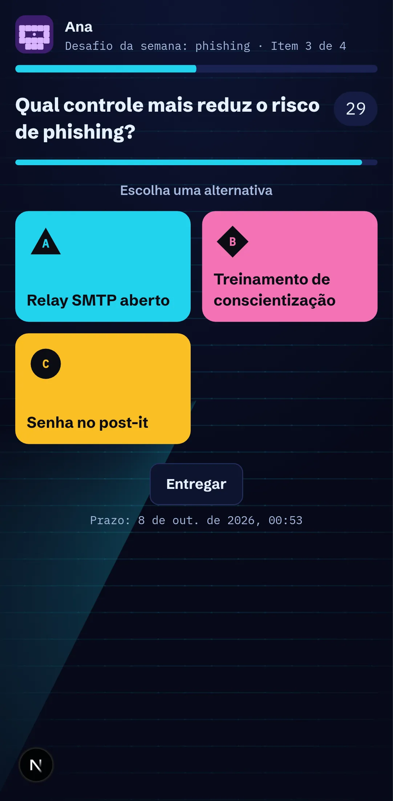 |
| 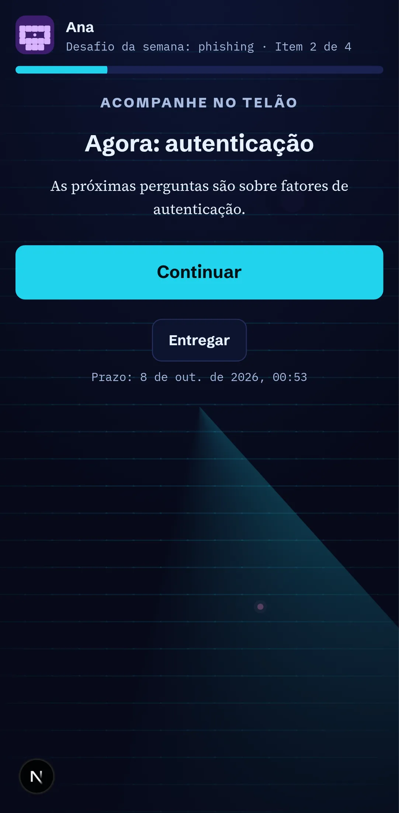 | 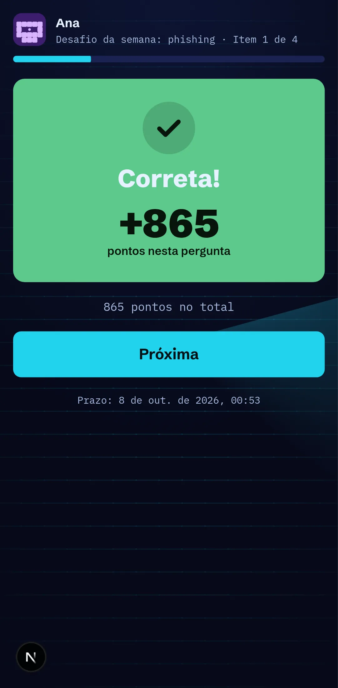 | 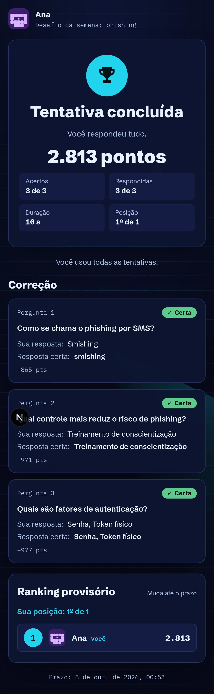 |
| 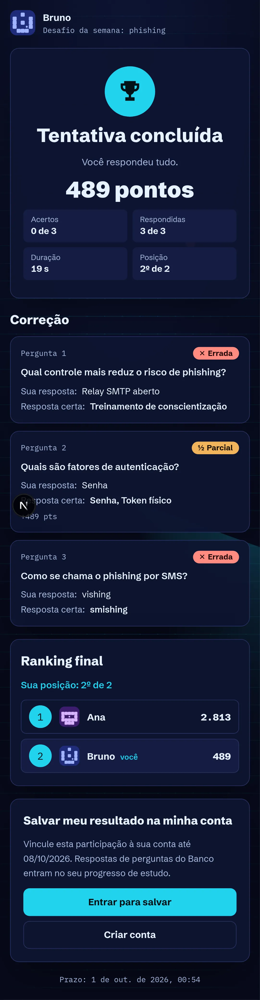 | 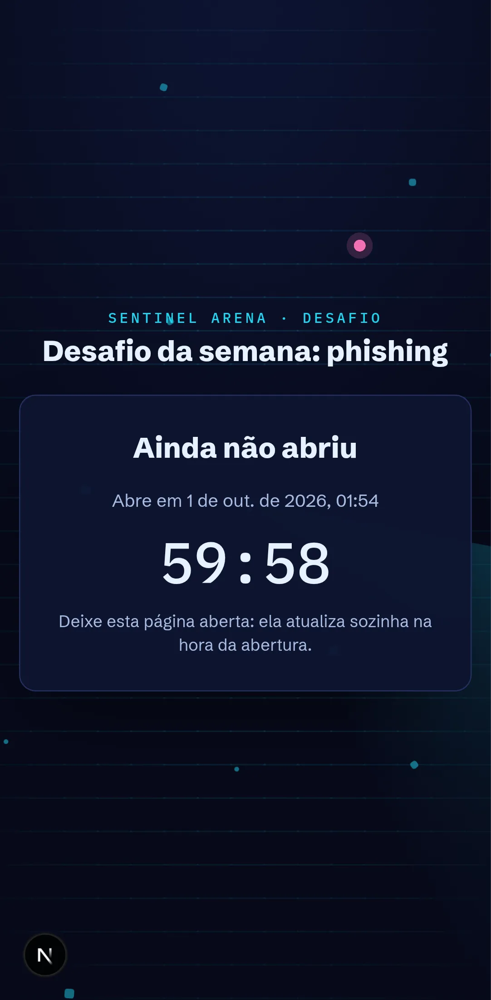 | 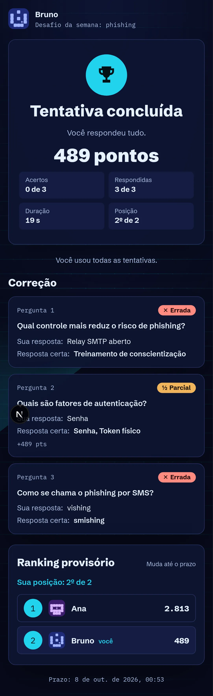 |

## O que foi entregue

### Backend
| Área | Arquivos | Destaques |
|---|---|---|
| Dados | `alembic/versions/0024_live_self_paced.py` | Slug, abertura, prazo e contador de aberturas na sessão. `attempt_no` na chave "uma resposta por item". Tabela `live_attempt` |
| Desafio | `services/live_challenge.py` | **Criação:** a partir da versão publicada, com os gates de licença e moderação; janela de até 90 dias; slug Crockford Base32 de 8 caracteres. **Tentativas:** 1 a 5, cada uma com ordem própria das perguntas (slides de conteúdo ficam no lugar) e das opções (os ids opacos da sessão continuam valendo). **Prazos preguiçosos:** por item (com o tempo estendido do participante), total e o fechamento do desafio. **Correção** a cada item, no fim, após o prazo ou nunca (RF-806). **Ranking:** conta a melhor tentativa concluída (RF-807); repetição pelo mesmo aparelho é marcada (RF-813) |
| API | `api/live_challenge.py` | Owner: `POST /challenges`, painel e prazo em `/sessions/{id}/challenge`. Participante: `/q/{slug}` (informações, entrada, acesso com código de retorno, tentativas, respostas, conteúdo, entrega, ranking). Rate limit por link e por token |
| Integração | `live_results.py`, `live_rights.py`, `runtime.py`, `gateway.py`, `live_retention.py` | Relatório, CSV, "meus resultados" e "meus dados" contam a tentativa válida e respeitam a política de correção. O QR aponta para o link. Encerrar (host ou admin) fecha o desafio. WebSocket, SSE e o token do telão recusam desafios. O job `live-cleanup` fecha os desafios vencidos |

### Frontend (`web/`)
- **Criar desafio:** ao lado de "Apresentar", no editor e na biblioteca. Prazo com atalhos, tentativas, tempo, política
  de correção (com a recomendação do RF-813 quando há ranking), embaralhar e exigir login.
- **Painel** (`/quizzes/{id}/challenges/{sessão}`), atualizado a cada 10 s:
  - estado, contagem regressiva, link, QR e "Copiar";
  - funil, quem está respondendo agora, tentativas por pessoa e duração mediana;
  - top 10 e conclusões recentes com a marca "Repetição?";
  - "Adiar prazo", "Fechar agora" e "Ver relatório".
- **Participante** (`/q/{slug}`):
  - estados agendado (com contagem), aberto e encerrado;
  - entrada com consentimento e código de retorno, e card de regras antes de começar;
  - os mesmos componentes de resposta do ao vivo, para todos os tipos, e slides de conteúdo;
  - cronômetro corrigido pelo relógio do servidor; a resposta é reenviada com o mesmo `answer_id` (idempotente);
  - "Entregar" antes do fim, correção por item com placar parcial, resumo com posição e correção conforme a política;
  - "Tentar de novo", ranking e cartão para salvar o resultado na conta.
- **Relatório e listas:** o relatório ganha o bloco do desafio (funil, tentativas, repetições). As listas de sessões
  mostram "Desafio" e levam ao painel.

## Validação

**Carga** (PostgreSQL 16, 2 workers, gerador no mesmo host de 4 núcleos, `scripts/live/challenge_load.py`):

| Cenário | Resultado |
|---|---|
| 1.000 pessoas começando em 90 s, 5 perguntas, 2 a 30 s por pergunta | 1.000 entradas e 5.000 respostas aceitas, sem erro. p95: entrada 43 ms, início 38 ms, resposta 47 ms. Painel 73 ms; relatório 421 ms |
| 1.000 pessoas em 60 s (~160 req/s, saturação) | Nenhum erro, mas o p95 sobe para 1,1–1,9 s: a CPU dos 2 workers acaba (o gerador divide a máquina). Escala com mais workers |

A primeira versão fazia ~11 consultas por resposta. Ela lia a sala e a sessão várias vezes e recalculava o ranking
inteiro a cada pessoa que terminava; com 200 pessoas o p95 passava de 1,7 s e o relatório levava 1,1 s.

Ajustes no backend:
- a sala é montada a partir da sessão já carregada;
- os objetos continuam válidos depois do commit;
- o ranking fica em cache por até 2 s enquanto o desafio está aberto;
- a posição de cada pessoa sai de duas consultas agregadas.

Resultado: ~6 consultas e ~9 ms por resposta, e relatório de 0,2 s com 200 pessoas.

```bash
cd backend && python -m pytest -q                       # 490 testes (20 novos em test_live_challenge.py)
TEST_DATABASE_URL=postgresql+psycopg://… python -m pytest -q tests/test_migrations.py   # 0024 no PostgreSQL
cd web && npm run typecheck && npm run lint && npm test && npm run build
cd web && node scripts/live-smoke-challenge.mjs
python scripts/live/challenge_load.py --participants 1000 --window 300
```

Evidências (01/10/2026):
- **Backend:** suíte completa verde. A migração 0024 passou em SQLite e PostgreSQL 16.
- **Web:** typecheck, lint sem erros, 534 testes, build.
- **Navegador real, sem erro de página, console ou HTTP:**
  - `live-smoke-challenge.mjs`: 6 verificações.
    - O desafio é criado pelo editor, com ranking e correção a cada pergunta.
    - Dois celulares jogam todos os tipos do quiz.
    - O painel mostra as duas conclusões; o owner fecha o desafio, e o relatório conta os dois.
    - O desafio agendado mostra a contagem.
  - `live-smoke.mjs`, `live-smoke-ops.mjs` e `live-smoke-ga.mjs` continuam verdes.

Ajustes feitos durante a validação:
- **Correção a cada pergunta:** o relógio da pergunta seguinte começava enquanto a pessoa lia a correção. O próximo
  item agora só é revelado (e cronometrado) no "Próxima". Responder a um item ainda não mostrado volta `stale`.
- **Estado da tentativa:** ganha o placar parcial (só com correção a cada pergunta, para não revelar acertos) e as
  tentativas usadas.
- **Cabeçalho do celular:** durante a correção, mostra o número da pergunta corrigida, não o da próxima.
- **Relatório:** chama o código do desafio de "link", não de "PIN".

## Desvios do plano

| Plano | Incremento 6 | Motivo / próximo passo |
|---|---|---|
| E-mail de resumo ao fechar (J5.5) | Não | Fase F2, como no plano |
| Anti-fraude por IP /24 (RF-813) | Só aparelho (`dev_h`) e nome único | O IP é sinal fraco atrás de NAT; ligar junto com o alerta do admin |
| Painel via SSE (RF-809) | Poll de 10 s | O critério aceita os dois. O poll não segura conexões |
| Retomar em outro aparelho sem código | Com o código de retorno | O token do participante não fica em `localStorage` (regra do Incremento 4) |
| Modo prática e híbrido (RF-811/812) | Não | Fase F2 |

## Próximos passos (MVP-1)
1. Mais 3 temas.
2. IA a partir de PDF.
3. Colaboração.
4. Controle remoto.
5. 2.000 participantes por sala.
