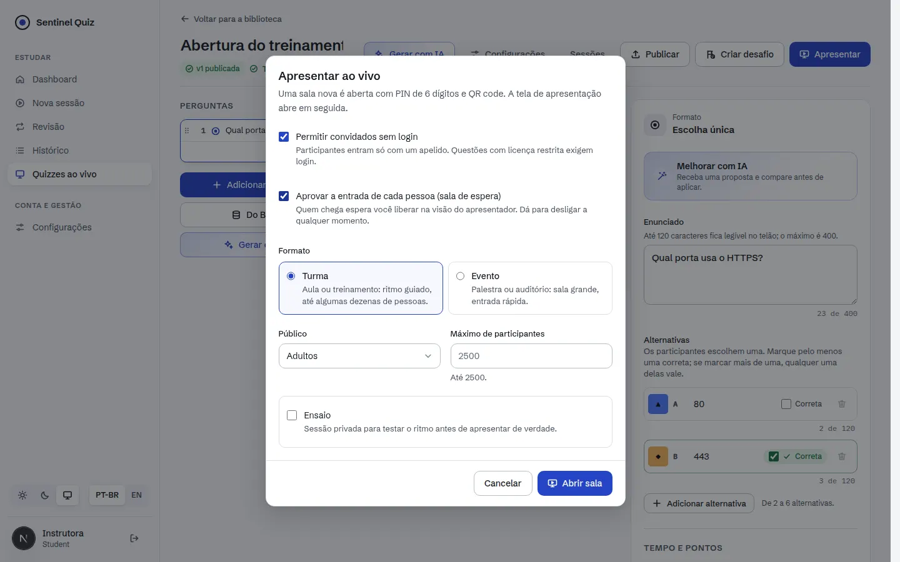
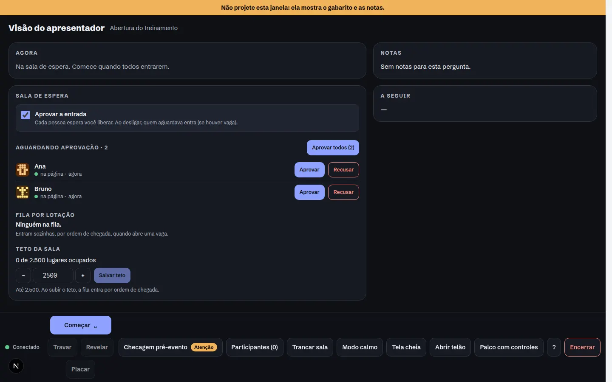
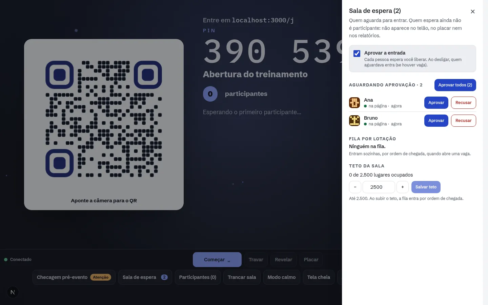
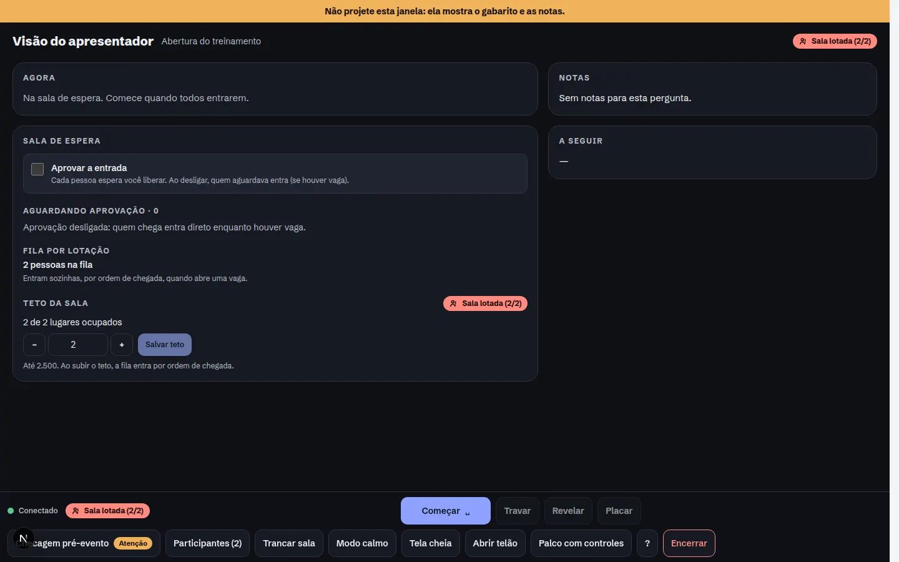
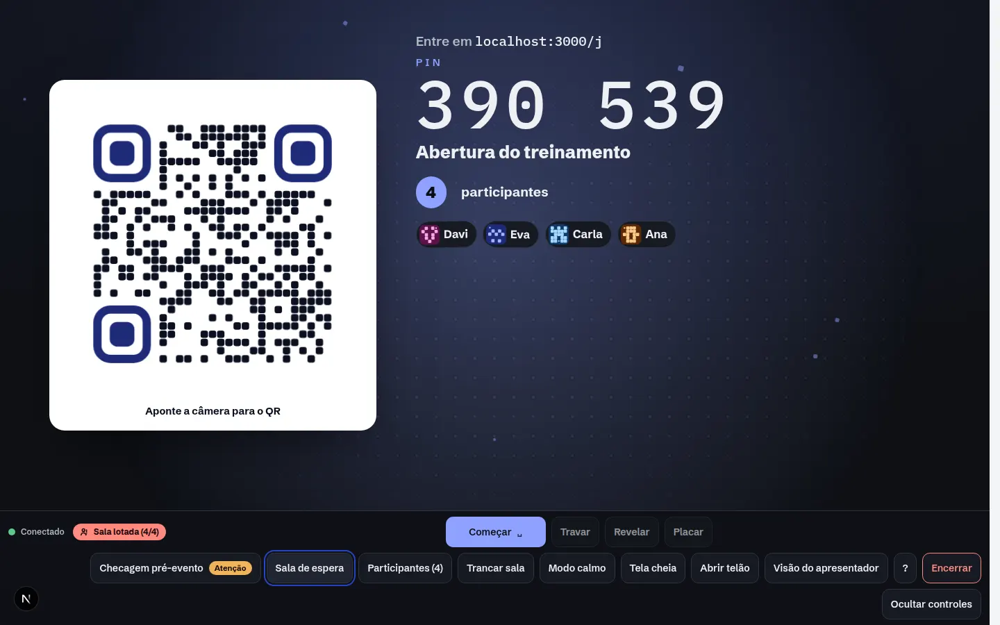
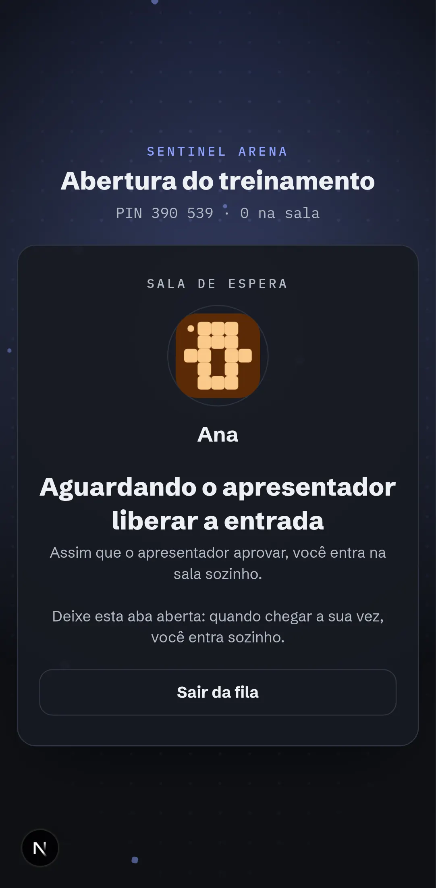
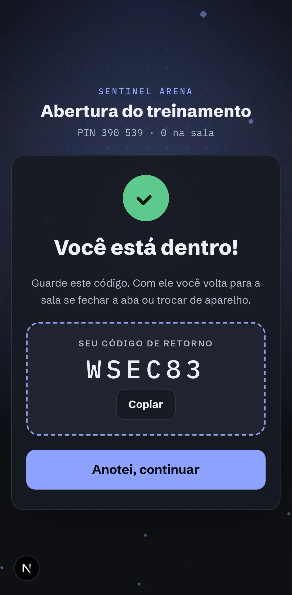
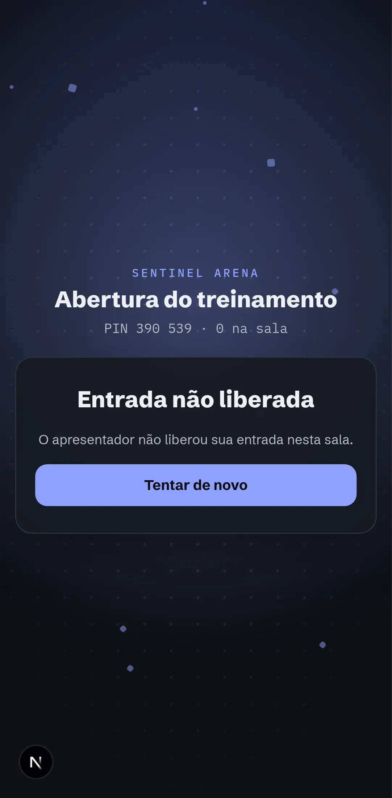
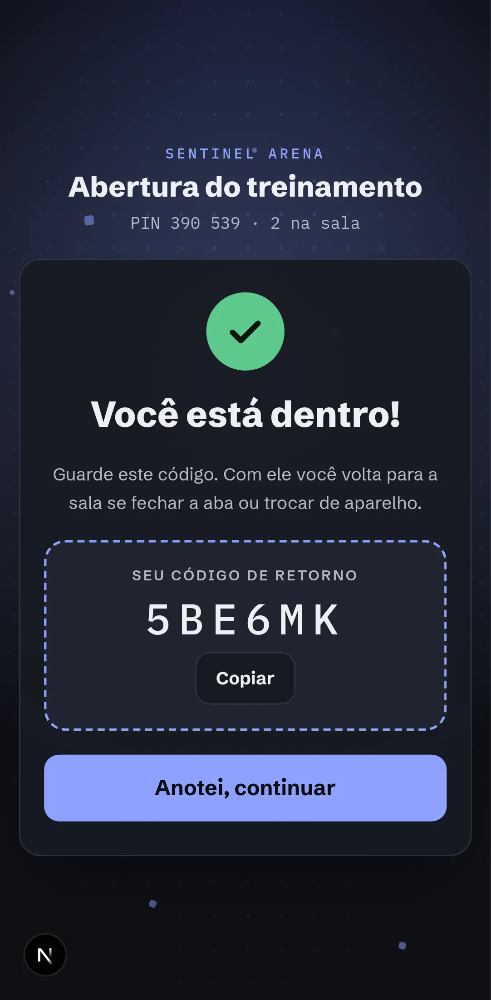

# Sentinel Arena: Incremento 7 (2.000 por sala e sala de espera)

Terceiro passo do MVP-1 (GA) do [plano](./PLANO.md): o épico E1.20, com DC-16 (lotação) e RF-545 (aprovação),
sobre o [contrato](./CONTRATO-INCREMENTO-7.md).
- **Capacidade:** o teto padrão passa a ser de **2.000 participantes por sala**.
- **Sala cheia:** a pessoa não é mais recusada; ela entra numa **fila** e ocupa a vaga sozinha quando ela abre.
- **Aprovação:** o apresentador pode exigir que cada entrada seja aprovada.

## Telas

| | |
|---|---|
|  |  |
|  |  |
|  | |

| | | |
|---|---|---|
|  |  |  |
|  |  | |

## O que foi entregue

### Backend
| Área | Arquivos | Destaques |
|---|---|---|
| Dados | `alembic/versions/0025_live_waiting_room.py` | `live_session.require_approval` e a tabela `live_join_request`. Quem espera **não** é participante: fica fora das contagens, do ranking, dos relatórios e do lobby. Um índice único parcial reserva o nome enquanto a pessoa espera |
| Admissão | `services/live_admission.py` | **Entrada:** 202 com `wait_token` (credencial só da espera, guardada como hash). **Espera:** poll em `GET /api/live/queue/{id}` no ritmo do servidor (3 a 15 s). **Admissão:** o `join` normal, com o código de retorno só na primeira entrega e token novo a cada entrega. **Vagas:** distribuídas em ordem de chegada (FIFO) quando o host expulsa alguém, quando dados são excluídos, quando o teto sobe ou quando a aprovação é desligada. Quem parou de consultar há mais de 45 s perde a vez. **Teto exato:** perto do teto (128 vagas), a decisão usa trava de linha da sala |
| Comandos | `live/runtime.py`, `live/gateway.py`, `live/protocol.py` | `host.admit` (lista ou todos), `host.reject`, `host.set_capacity` (até o teto da plataforma), `host.set_approval`. O host recebe o bloco `waiting_room` no snapshot e `waiting_room.update` no mesmo tick agrupado do lobby. O telão não recebe nada da fila. Encerrar a sessão expira a fila |
| Desempenho | `live/runtime.py`, `live/gateway.py` | **Pódio:** em cache por (sessão, `state_seq`), lido só com colunas. **Mensagens personalizadas:** a parte pública é serializada uma vez e só o bloco `my` muda por pessoa. **Contagem por opção:** incremental, com marca d'água das respostas já assentadas. **Snapshot do participante:** a assinatura do ranking é reaproveitada por 0,5 s. **Lobby:** a contagem é feita uma vez por tick |
| Operação | `services/live_preflight.py`, `core/config.py`, compose | `LIVE_MAX_PARTICIPANTS=2000`, `LIVE_WAITING_ROOM_MAX`, `LIVE_WAITING_STALE_SECONDS`, `LIVE_SOCKETS_PER_WORKER`. A checagem pré-evento avisa quando a sala passa de `UVICORN_WORKERS × 500` sockets. O rate limit da sala sobe para 12.000/min, e o poll da fila usa o bucket do token |

### Frontend (`web/`)
- **Celular** (`features/quiz-play/components/waiting-room.tsx`, `quiz-live/lib/use-waiting-room.ts`):
  - depois do "Entrar", o 202 leva à tela de espera, com nome e avatar;
  - o texto depende do motivo: espera pela aprovação, ou "A sala está cheia" com a posição na fila e o total;
  - o poll segue o ritmo do servidor, com jitter de 20%, só com a aba visível, e recua até 30 s quando falha;
  - recarregar a página mantém o lugar (o ticket fica no `sessionStorage`);
  - **admitido:** segue o fluxo normal (código de retorno e sala);
  - **outros fins:** recusa, expiração, saída e ticket inválido têm mensagem própria e "Tentar de novo";
  - anúncio `aria-live` quando a posição muda.
- **Apresentador:**
  - painel "Sala de espera" na visão do apresentador e um diálogo aberto pelo botão da barra do palco, com o número
    de pessoas aguardando;
  - no painel: o liga/desliga da aprovação; a lista de quem aguarda (na página ou não, há quanto tempo, se entrou com
    conta) com "Aprovar", "Recusar" e "Aprovar todos"; o tamanho da fila por lotação; o teto da sala, até o teto da
    plataforma.
- **Apresentar:** opção "Aprovar a entrada de cada pessoa (sala de espera)" no diálogo.

## Validação

**Carga** (PostgreSQL 16, Redis, nginx de produção com TLS, gerador no mesmo host de 4 núcleos):

| Cenário | Resultado |
|---|---|
| 2.000 participantes, 2 workers, 5 perguntas | **Entradas:** 2.000 em 9 a 13 s, de um único IP, sem 429. **Respostas:** 5 × 2.000 aceitas. **Revelação:** chega a todos em até ~0,9 s. **Relatório:** 0,6 a 0,9 s. **Ack no servidor:** média de 46 a 55 ms (p95 no bucket de 150 ms) |
| Ack medido no cliente | p95 de 236 a 452 ms, acima da meta de 300 ms porque o gerador divide a CPU com o servidor. O critério do plano usa k6 de fora do host no game day. Com 3 workers não houve ganho neste host compartilhado |
| Sala de espera: 2.000 pessoas para um teto de 1.800 (`scripts/live/waiting_room_load.py`) | Exatamente 1.800 na sala e 200 na fila, com ~41 polls/s. Depois que o host subiu o teto, todos entraram: p50 1,6 s, p95 2,7 s, máx. 4,3 s |
| Caos com 2.000 (`scripts/live/chaos.py`, `kill -9` de um worker) | Todas as respostas tiveram ack e foram gravadas, e a revelação chegou aos 2.000. Com 2 workers, o worker morto segurava 1.638 sockets, e a reconexão levou até 16,9 s (~100 sockets/s por worker). Com 4 workers (~500 sockets cada), todos voltaram em até 1,9 s |

**Recomendação de operação:** salas de 2.000 pedem `UVICORN_WORKERS ≥ 4`. A checagem pré-evento avisa quando isso
falta.

Ajustes que a carga revelou:
- **Teto ultrapassado:** a primeira versão sentou 1.807 pessoas numa sala de 1.800. Era uma corrida entre contar e
  inserir em workers diferentes. A decisão perto do teto agora usa trava de linha (`SELECT … FOR UPDATE`) na entrada,
  na distribuição de vagas e na aprovação. Com isso, o teto ficou exato.
- **Revelação:** a fan-out reserializava o mesmo payload para cada pessoa. Agora só o bloco `my` muda por pessoa. A
  média no servidor caiu de 227 para ~100 ms.
- **Snapshot:** o pódio carregava todos os eventos como objetos ORM. Agora usa um cache lido só com colunas, e o
  snapshot do participante caiu de ~45 para ~8 ms.
- **Botões do painel:** "Aprovar", "Aprovar todos" e "Salvar teto" ficavam invisíveis, porque a cor neutra do
  botão vencia a de destaque. Cada variante agora tem as próprias cores. O problema foi achado no smoke.

```bash
cd backend && python -m pytest -q                       # 499 testes (test_live_waiting_room.py e outros)
cd web && npm run typecheck && npm run lint && npm test && npm run build
cd web && node scripts/live-smoke-waiting.mjs
python scripts/live/loadtest.py --participants 2000 …
python scripts/live/waiting_room_load.py --participants 2000 --cap 1800 …
```

Evidências (01/10/2026):
- **Backend:** suíte completa verde.
- **Web:** typecheck, lint sem erros, 555 testes, build.
- **Navegador real, sem erro de página, console ou HTTP:**
  - `live-smoke-waiting.mjs`: 15 verificações.
    - A sala é aberta com aprovação pelo editor.
    - Dois celulares esperam. O apresentador aprova um, que entra sozinho com o código de retorno, e recusa o
      outro.
    - O palco mostra só a contagem, sem nomes.
    - Com a aprovação desligada e o teto em 2, uma pessoa entra direto e duas vão para a fila. A segunda recarrega
      a página e mantém o lugar.
    - O host sobe o teto, as duas entram na ordem, e o lobby mostra 4.
  - `live-smoke.mjs`, `live-smoke-ga.mjs` e `live-smoke-challenge.mjs` continuam verdes.

## Desvios do plano

| Plano | Incremento 7 | Motivo / próximo passo |
|---|---|---|
| 5.000 por sala sob flag (F3) | Não | Fase F3, como no plano. `LIVE_MAX_PARTICIPANTS` já aceita valores maiores para testes |
| Selo de espera no telão | Não | O telão não recebe dados da fila (privacidade). A contagem fica na barra do palco com controles |
| Aviso push quando a vaga abre | Poll do celular | Sem push na web anônima. O poll segue o ritmo do servidor |
| Ack p95 ≤ 300 ms medido no cliente | Medido no servidor (média de 46 a 55 ms) | O gerador dividia a CPU com o servidor. Validar com k6 externo no game day |

## Próximos passos (MVP-1)
1. Relatórios completos (E1.18).
2. Apresentação+ (E1.17).
3. Mais 3 temas (E1.9).
4. IA a partir de PDF e biblioteca (E1.16).
5. Templates (E1.19) e hardening (E1.21).
